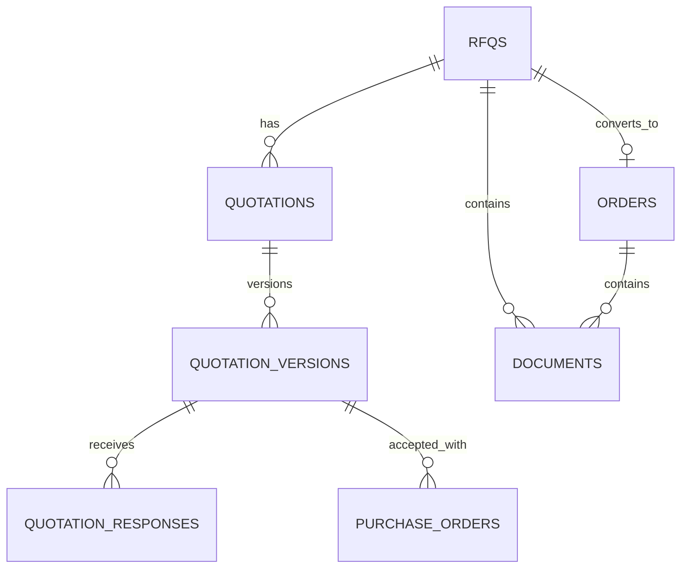

# PostgreSQL proposal

Every business table includes `company_id`, timestamps and an immutable primary key where relevant.

Tables: `rfqs`, `quotations`, `quotation_versions`, `quotation_responses`, `quotation_rejections`, `purchase_orders`, `purchase_order_versions`, `orders`, `documents`, `document_versions`, `document_permissions`, `document_download_events`, `workflow_events`, `notifications`, and append-only `audit_events`.

Key constraints:

- unique `(quotation_id, version_number)`;
- one current quotation version per quotation using a partial unique index;
- unique active response per quotation version;
- unique active PO submission per quotation version and idempotency key;
- unique `orders.source_rfq_id`;
- foreign keys include company consistency checks enforced by transaction/service policy;
- audit events cannot be updated or deleted by application roles.

Documents store an opaque private-storage key, MIME, bytes, integrity hash, uploader/role, visibility, category, version and active/superseded state—not file bytes or permanent public URLs.
