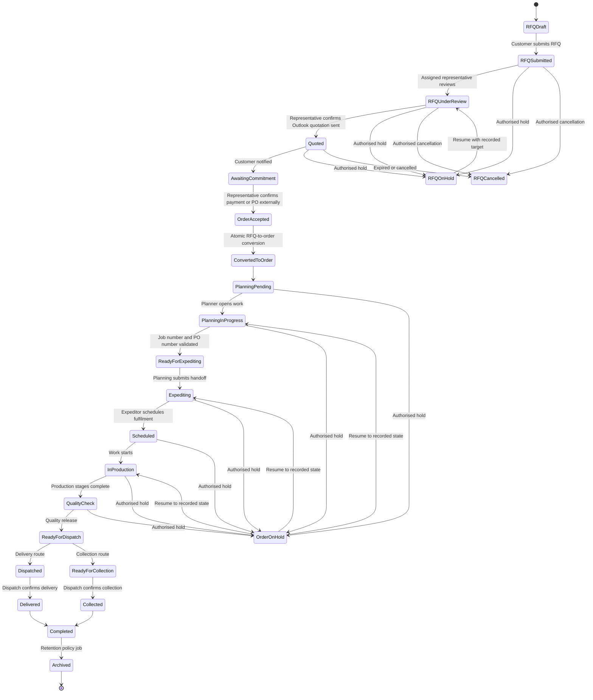

# Order Workflow Implementation Plan

- Status: analysis complete; Phase 1 state machine implemented
- Application version reviewed: 2.4.0; workflow implementation updated for 2.5.0
- Reviewed branch: `agent/improve-theme-readability-and-reps`
- Reviewed commit: `d238196`

## 1. Purpose and scope

This document originally mapped the Rhomberg Test App before implementation. Phase 1 now implements the controlled state machine, service action boundary, audit/notification mock records and transition tests. Separate order creation, role-specific workspaces and the private-cloud backend remain future phases.

Implementation details and the authoritative transition flow are documented in `WORKFLOW_STATE_MACHINE.md`.

The analysis preserves these project constraints:

- retain the existing visual design and working GitHub Pages mock preview;
- keep React components independent of browser storage;
- keep mock and future API services interchangeable;
- use shared validation and user-friendly errors;
- enforce company-level access on the server in production;
- create business-history and audit records for important actions;
- introduce no real customer data, credentials, API keys, passwords or pricing data;
- retain current features until an approved replacement is ready.

## 2. Executive summary

The application already has a sound migration boundary. React calls asynchronous services, the GitHub Pages build selects a mock service, and the production build selects an API service. Only the browser-store adapter calls `localStorage`, and the service worker excludes API responses from its cache.

The catalogue, product configurator, RFQ submission screens, customer timeline, internal queue, validation framework, role constants, PDF styling, service error format and company-filtering tests can all be reused.

The central workflow limitation is the current record model:

- a mock "order" is still an enquiry record;
- one `trackingStatus` field represents both RFQ and order progress;
- an expeditor can choose any recognised status, including skipping or reversing stages;
- sales representatives cannot currently mark a quotation as sent;
- there are no Planning or Dispatch capabilities/workspaces;
- there is no atomic RFQ-to-order conversion;
- no notification inbox or delivery history exists;
- `trackingHistory` is only a customer timeline, not a complete audit trail;
- order-summary download/email and retention processing are not implemented.

The safest approach is to define the state machine and audit contract first, then introduce separate enquiry and order services in mock mode, and only afterwards add role-specific screens. The private-cloud API and PostgreSQL implementation should follow after mock behaviour and company-isolation tests are stable.

## 3. Current application architecture

```text
index.html
  -> src/main.jsx
      -> ErrorBoundary
          -> App.jsx (session, view and workflow orchestration)
              -> React screens
              -> services/index.js (GitHub Pages mock build)
              -> services/apiEntry.js (API-only production build)

Mock build                              API-only build
createMockServices                     createApiServices
  -> browserStore                        -> HttpClient
  -> catalogue/reference fixtures        -> /api/v1
  -> RFQ email/PDF test adapters          -> secure cookie + CSRF
  -> same-browser persistence             -> server-authoritative records
```

### 3.1 Build and hosting modes

| Mode | Entry implementation | Persistence | Intended use |
|---|---|---|---|
| GitHub Pages preview | `src/services/index.js` -> `createMockServices()` | Browser store | Public demonstration with fabricated data only |
| Private-cloud candidate | build alias -> `src/services/apiEntry.js` -> `createApiServices()` | Backend API; browser storage only for theme | Future company staging/production |
| Netlify test delivery | Static preview plus `netlify/functions/submit-rfq.mjs` | External email delivery only; not the future system of record | Current protected RFQ-email test path |

`scripts/build-production.mjs` physically excludes mock accounts, public fallback email code, test RFQ markers and source maps from the API-only artifact. This separation should remain.

### 3.2 Navigation and routes

The app does not use a URL router. `App.jsx` stores a `view` string and conditionally renders screens.

| Audience | Current view | Component | Purpose |
|---|---|---|---|
| Everyone | introduction | `Intro` | Opening animation |
| Signed out | authentication | `Auth` | Demo sign-in and customer registration |
| Customer | `home` | `Home` | Customer dashboard and recommended categories |
| Customer | `catalogue` | `Catalogue` | Category/product discovery |
| Customer | `product` | `ProductDetail` | Product information and datasheets |
| Customer | `configurator` | `Configurator` | Guided product configuration |
| Customer | `enquiry` | `Enquiry` | RFQ details, representative, fulfilment and PO |
| Customer | `tracking` | `OrderTracking` | Combined RFQ/order timeline |
| Customer/staff | `account` | `Account` | Profile and visible record history |
| All non-customer roles | `expeditor` | `ExpeditorDashboard` | Combined internal queue; read-only unless role may update tracking |

There are no dedicated sales representative, Planning, Buyer, Manager, Administrator or Dispatch screens yet. All staff roles are routed to the expeditor-shaped workspace.

### 3.3 Reusable React components

| Component | Reuse assessment |
|---|---|
| `Auth` | Reuse the design and service callbacks. Production onboarding, MFA/SSO and account approval remain backend concerns. |
| `Home` | Reuse. Its activity counts should later use separate enquiry/order summaries. |
| `Catalogue`, `ProductDetail`, `Configurator` | Reuse substantially. They are already service-fed and independent of persistence. |
| `Enquiry` | Reuse for customer RFQ creation. PO timing needs business confirmation because the future workflow says payment/PO occurs after quotation outside the app. |
| `OrderTracking` | Reuse its visual timeline and cards, but feed it separate enquiry/order view models and notification state. |
| `ExpeditorDashboard` | Reuse card/search patterns. Split role actions from the current unrestricted status selector. |
| `Account` | Reuse. Later add notification preferences, authorised companies and archived records if approved. |
| `Layout` | Reuse header, navigation, notices, toast and theme controls. Staff navigation will need role-specific destinations. |
| `ErrorBoundary` | Reuse. Production monitoring should record only sanitised correlation data. |

### 3.4 Current service contracts

All methods are asynchronous, which is the correct foundation for interchangeable mock/API implementations.

```text
initialize()

auth
  getSession()
  signIn(credentials)
  register(account)
  signOut()
  getDemoLogins()

accounts
  getCurrent()
  getRegistrationOptions()
  listCompanies()

products
  getCatalogue()
  list(filters)
  getById(productId)

enquiries
  list(filters)
  getById(enquiryId)
  getDraft()
  saveDraft(items)
  submit(details, items)

tracking
  list(filters)
  updateStatus(enquiryId, update)

preferences
  getTheme()
  setTheme(theme)
```

The future workflow should extend this boundary rather than allowing new screens to call fetch, email, PDF or storage code directly.

### 3.5 Current domain and supporting modules

| Area | Current module | Notes |
|---|---|---|
| Product rules | `src/domain/productConfiguration.js` | Reusable conditional-field and option logic |
| Tracking statuses | `src/domain/tracking.js` | Reusable labels/progress concept; status list and free advancement need replacement |
| Shared validation | `src/services/validation.js` | Reusable error format; needs workflow-specific validators |
| Roles/permissions | `src/services/contracts.js` | Useful base; missing Planning/Dispatch decisions and workflow permissions |
| Product catalogue | `src/data/catalogue.js` | 8 categories and 82 current product/product-family records |
| Branch/rep fixtures | `src/data/branches.js`, `src/data/representatives.js` | Useful in mock mode only; production master data must come from approved sources |
| RFQ PDF | `src/lib/rfqPdf.js` | Visual layout can seed an unpriced order-summary template |
| RFQ email | `src/lib/rfqEmail.js` | Demo/test delivery only; not suitable as the production notification service |
| Protected email test | `netlify/functions/submit-rfq.mjs` | Current test adapter, not the private-cloud workflow API |
| Service worker | `sw.js` | Reusable; already avoids caching `/api/` responses |

## 4. Current models and mock-data structures

### 4.1 Account

```text
id, companyId, company, contact, email, phone, area, industry,
role, createdAt
```

The mock persistence record also contains a fabricated plaintext demo password. `toPublicAccount()` removes it before the account reaches React state. Production must never store or return a plaintext password.

### 4.2 Enquiry

```text
id, reference, version, accountId, companyId,
company/contact/email/phone display snapshots,
area, application, medium, emergency,
fulfilment, deliveryAddress, collectionBranch, notes,
poMode, poNumber, poFileName,
selectedRep, items,
trackingStatus, status, trackingHistory,
email-delivery metadata,
createdAt, updatedAt
```

The enquiry currently becomes order-like when its `trackingStatus` reaches `po-received`. There is no separate order object in mock mode.

### 4.3 Configured enquiry item

```text
lineId, productId, code, name, description/image snapshots,
category, variant, quantity, configuration, updatedAt
```

Product-specific configuration is correctly represented as a flexible object and revalidated against the authoritative product definition inside the service.

### 4.4 Tracking event

```text
id, status, note, actor, createdAt
```

The event lacks actor ID, actor role, company ID, visibility, previous state, entity type, request/correlation ID, outcome and immutable audit metadata.

### 4.5 Product

Products contain stable IDs/codes, category, specification snapshots, configuration-field schemas, datasheets and business rules. The existing configuration engine supports choice, multi-choice, select, text, textarea and toggle inputs with conditional visibility and dependent options.

### 4.6 Missing mock models

The mock implementation does not yet have dedicated structures for:

- orders and order items;
- quotation metadata;
- Planning handoff data;
- Dispatch data;
- notifications and delivery attempts;
- generated order summaries;
- retention policies and archive jobs;
- complete append-only audit events;
- staff branch/queue scope beyond the current role checks.

## 5. Browser-storage dependency audit

### 5.1 Direct dependencies

Only `src/services/browserStore.js` accesses `globalThis.localStorage`. No React component accesses `localStorage`, `sessionStorage`, IndexedDB or cookies directly.

Current mock keys are:

| Key purpose | Current key |
|---|---|
| Accounts | `rhombergPreviewAccountsV2` |
| Session | `rhombergPreviewSessionV2` |
| Per-account RFQ drafts | `rhombergPreviewDraftV2` |
| Enquiries plus combined tracking history | `rhombergPreviewEnquiriesV2` |
| Theme preference | `rhombergPreviewThemeV1` |
| Demo seed version | `rhombergPreviewSeedV4` |

Legacy V1 account/session/enquiry keys are read during mock initialisation and migrated into the current store.

### 5.2 API-mode browser storage

`createApiServices()` uses the browser-store adapter only for the non-sensitive theme preference. Authentication is designed for secure server cookies, not Web Storage.

### 5.3 Cache Storage

`sw.js` uses the browser Cache API for the public application shell and assets. It explicitly bypasses `/api/` requests and fetches runtime configuration network-first. Cache Storage is not used for accounts, RFQs, orders or documents.

### 5.4 Storage implications for future phases

- Add new mock persistence only inside `createMockServices()` or a mock repository used by it.
- Version and migrate the mock schema; do not silently discard existing preview RFQs.
- Store order, notification and audit fixtures under separate keys or a versioned aggregate store.
- Never persist uploaded document bytes or real customer information in the public preview.
- Continue testing that React contains no storage imports or direct storage calls.

## 6. Current access control and company isolation

### 6.1 Existing safeguards

- Customers receive enquiries only when `enquiry.companyId === account.companyId`.
- Direct access to another mock company enquiry returns a not-found error.
- Customer draft data is keyed by account.
- Sales representatives are intended to read assigned-company records.
- Expeditor, Buyer, Manager and Administrator permissions are represented.
- The proposed PostgreSQL schema includes `user_company_access`, representative assignments and row-level security.
- The API client uses cookies, CSRF, request IDs, idempotency keys and structured errors.

### 6.2 Important limitations

- Browser mock isolation is demonstrative, not security. Anyone controlling the browser can alter stored data.
- The customer filter in `App.jsx` is only a display safeguard; production enforcement must occur in every server query.
- Current staff mock visibility is broad. Expeditors can see all mock enquiries, without branch scope.
- The proposed RLS helper currently grants Expeditor, Buyer, Manager and Administrator access to every company. This conflicts with the stated "authorised branch/scope" goal for some roles.
- A sales representative cannot currently retrieve assigned companies through `accounts.listCompanies()` unless separately granted broad company-read permission.
- The generic tracking endpoint accepts an actor display value from the browser. Production must ignore it and derive identity/role from the session.
- Document and PDF authorisation are proposed but not wired into the interface or service layer.

## 7. Current statuses compared with the required workflow

Current UI statuses:

```text
rfq-submitted -> under-review -> quotation-sent -> po-received -> scheduled
-> in-production -> quality-check -> ready -> dispatched -> completed

on-hold is also selectable at any time
```

The current `nextTrackingStatus()` suggests a linear path, but the internal screen also exposes every status in a dropdown. The service checks only whether a status ID exists; it does not enforce the previous state, role, fulfilment method or required data.

| Current status/capability | Fit with required workflow | Conflict or gap |
|---|---|---|
| `rfq-submitted` | Direct match | No assigned-rep notification history |
| `under-review` | Reusable | Ownership is not restricted to the assigned rep |
| `quotation-sent` | Close to "Quoted" | Expeditor currently sets it; no rep action, quotation metadata or customer notification record |
| `po-received` | Partial match | Conflates external customer commitment, rep acceptance, RFQ conversion and order creation |
| `scheduled` | Partial match | Skips Planning, internal job number, customer PO capture and handoff to Expediting |
| `in-production` | Reusable | No configured production-stage model or partial-line handling |
| `quality-check` | Reusable | Role ownership and entry/exit guards are undefined |
| `ready` | Ambiguous | Does not distinguish ready for Dispatch, ready for delivery or ready for collection |
| `dispatched` | Delivery only | No collection path, delivery confirmation or completion evidence |
| `completed` | Reusable terminal state | No retention/archive lifecycle |
| `on-hold` | Useful exception state | No reason code, owner, resume target or permission rules |
| Generic status update | Not safe for production | Allows skipping, regression and role bypass |

Required states not represented clearly include:

- order accepted by the representative;
- RFQ converted to a distinct order;
- Planning pending/in progress;
- ready for Expediting / handed to Expediting;
- ready for Dispatch;
- ready for collection and collected;
- delivered;
- archived;
- cancelled/expired paths in the current UI;
- notification pending/sent/failed state separate from business state.

## 8. Proposed state-transition model

The server must own the state machine. The UI should receive allowed actions and should never manufacture the next status itself.



`AwaitingCommitment` may be represented as a display phase rather than a separately stored state if the business prefers `quoted` to remain active until acceptance. That decision should be made before coding.

### 8.1 Transition invariants

Every successful workflow action should commit atomically:

1. the entity state/version change;
2. an immutable business workflow event;
3. an immutable security/audit event;
4. required notification-outbox records.

If any required database write fails, the transition should roll back. Notification delivery itself is asynchronous; a temporary email failure must not reverse the business transition.

Every transition request should include an idempotency key and expected entity version. The server derives actor, role, company scope and representative assignment from the authenticated session.

### 8.2 Proposed transition ownership

| Action | Proposed owner | Required guard |
|---|---|---|
| Submit RFQ | Customer | Own authorised company; valid configuration; assigned active representative |
| Start review | Assigned sales representative | Active representative-company assignment |
| Mark quoted | Assigned sales representative | Current state under review; external send date/reference recorded |
| Confirm order accepted | Assigned sales representative or approved manager | Current state quoted; acceptance basis recorded; no payment-card/bank details stored |
| Convert RFQ to order | Server transaction initiated by authorised representative/manager | Accepted RFQ; no existing order; item snapshot fixed |
| Add job/PO numbers | Planning capability | Order in Planning; required identifiers valid and unique according to policy |
| Submit to Expediting | Planning capability | Required Planning fields complete |
| Update production/fulfilment | Expeditor capability | Allowed transition from current state; scoped queue access |
| Confirm dispatch/collection/delivery | Dispatch capability | Correct fulfilment route and preceding state |
| Archive | Scheduled retention worker or Administrator | Terminal state, retention elapsed, no legal hold |
| Download/email summary PDF | Authorised internal capability | Entity scope check; audit event; no pricing/customer secrets beyond approved summary fields |

## 9. Recommended service-layer evolution

Keep the existing services and add intent-specific methods. Avoid a generic UI-controlled `updateStatus()` for production workflow actions.

```text
auth
  existing methods
  getEffectivePermissions()

accounts
  existing methods
  listAuthorisedCompanies()
  listAssignableRepresentatives(companyId)

enquiries
  existing draft/submit/read methods
  getAllowedActions(enquiryId)
  startReview(enquiryId, expectedVersion)
  markQuoted(enquiryId, quotationMetadata, expectedVersion)
  acceptOrder(enquiryId, acceptanceMetadata, expectedVersion)
  convertToOrder(enquiryId, expectedVersion)
  placeOnHold()/resume()/cancel()

orders (new)
  list(filters)
  getById(orderId)
  getAllowedActions(orderId)
  savePlanning(orderId, planningData, expectedVersion)
  submitToExpediting(orderId, expectedVersion)
  transition(orderId, action, note, expectedVersion)
  placeOnHold()/resume()/cancel()

workflowHistory (new)
  listForEnquiry(enquiryId)
  listForOrder(orderId)

notifications (new)
  list(filters)
  getUnreadCount()
  markRead(notificationId)

documents (new)
  listForEntity(entityType, entityId)
  downloadOrderSummary(orderId)
  emailOrderSummary(orderId, recipientPolicy)

audit (new; authorised internal use only)
  list(filters)
  getForEntity(entityType, entityId)
```

Mock and API implementations must return the same shapes. Mock services should generate fabricated notifications and audit events; API services should delegate enforcement and persistence to the backend.

## 10. Safe implementation phases

### Phase 0 - Analysis and decisions (this phase)

- approve this architecture/gap analysis;
- confirm roles, statuses, required identifiers, notification channels and retention rules;
- make no runtime changes.

Exit gate: business owner and IT agree on the state names, transition owners and data classification.

### Phase 1 - Domain state machine, permissions and audit contract

- replace the loose status list with enquiry/order state definitions and allowed transitions;
- add workflow action permissions without changing visible screens;
- define workflow-event, audit-event and notification models;
- add shared validators for each intent-specific action;
- add mock schema version/migration support;
- add transition-matrix and denied-transition tests;
- update architecture, API and security documentation.

Exit gate: domain tests prove roles cannot skip or perform another role's transitions.

### Phase 2 - Separate mock enquiries and orders

- add interchangeable `orders`, `workflowHistory`, `notifications` and `audit` services;
- migrate current combined mock records without losing the GitHub Pages demo;
- create an order/item snapshot only through an atomic conversion method;
- adapt customer tracking through a compatibility view model so the design remains unchanged;
- add isolation tests for enquiry, order, event, notification and document records.

Exit gate: all existing customer demo paths work, while enquiry/order records are distinct internally.

### Phase 3 - Sales representative quotation workflow

- add assigned-representative queue using the existing internal-card design;
- add start-review and mark-quoted actions;
- record only external Outlook metadata, not quotation pricing or message credentials;
- create customer and representative notification entries;
- add visible timeline events and internal audit events;
- test reassignment, unauthorised reps, retries and notification failures.

Exit gate: only the assigned/authorised representative can mark the RFQ quoted, and the customer sees a notification/timeline event.

### Phase 4 - Acceptance, conversion and Planning

- capture order-acceptance basis without storing payment secrets;
- convert accepted RFQ to order atomically;
- add Planning queue/workspace;
- capture internal job number and customer PO number;
- validate required identifiers and submit the order to Expediting;
- audit every change and notify required recipients.

Exit gate: duplicate conversion is impossible and Expediting cannot receive an incomplete Planning record.

### Phase 5 - Expediting and Dispatch

- replace the free status dropdown with server/mock-provided allowed actions;
- add configured production/fulfilment stages;
- add separate Dispatch queue/actions for delivery and collection;
- distinguish internal notes from customer-visible notes;
- notify customer and assigned representative after every approved customer-visible update;
- cover holds, resume, cancellation and concurrency conflicts.

Exit gate: the complete happy paths and exception paths pass role, state and company-isolation tests.

### Phase 6 - PDFs, notification delivery and retention

- adapt the existing PDF styling to an approved unpriced order summary;
- provide authorised internal download and email actions through services;
- record PDF generation, download and email audit events;
- implement notification outbox/retry status;
- implement configurable retention, archive jobs, legal hold and archived-record queries;
- preserve active/completed customer views while hiding archived records by default.

Exit gate: documents never bypass scope checks, delivery failures are retryable, and retention tests prove no premature deletion.

### Phase 7 - Private-cloud API and PostgreSQL staging implementation

- implement the approved database migration and endpoints;
- keep GitHub Pages on mock services;
- implement branch/company scopes and row-level security;
- add object storage, malware scanning, email worker, audit sink and scheduled retention worker;
- run API contract tests against both mock and staging adapters;
- import only approved synthetic staging data.

Exit gate: penetration/isolation, backup/restore, email, upload and audit tests pass in a non-production environment.

### Phase 8 - Controlled pilot and production readiness

- perform user acceptance with Customer, Sales, Planning, Expediting and Dispatch representatives;
- validate accessibility, mobile responsiveness and performance;
- complete monitoring, alerting, runbooks, recovery rehearsal and security approval;
- deploy the same reviewed API-only artifact through the company pipeline.

Exit gate: signed business/IT approval and rollback plan.

After each phase run, at minimum:

```text
npm test
npm run check
npm run check:css
npm run build:netlify
npm run build:production
```

Add phase-specific transition, role, company-isolation, audit and API contract tests before declaring that phase complete.

## 11. Proposed database changes

The current SQL proposal already includes companies, branches, users, user-company access, representatives, representative assignments, product categories, products, enquiries, enquiry items, orders, tracking events, documents, drafts, sessions, idempotency, email outbox and audit events. The following changes are still required.

| Area | Required change |
|---|---|
| Roles/capabilities | Decide whether Planning and Dispatch are new roles or permissions assigned to existing staff roles. Prefer permission grants plus branch/team scopes if users may perform multiple functions. |
| Enquiry statuses | Add/confirm accepted, on-hold, cancelled/expired and converted states. Store hold reason and resume target separately. |
| Order statuses | Add Planning pending/in-progress, ready for Expediting, Expediting, ready for Dispatch, ready for collection, collected and delivered states. |
| Transition rules | Add a versioned workflow-definition/transition table or enforce an equivalent versioned server policy. Do not rely only on database enums. |
| Order items | Add immutable `order_items` snapshots. An order should not depend on mutable enquiry/product configuration after conversion. |
| Quotation metadata | Add a small `quotation_events` or enquiry metadata structure: external send timestamp, reference, marked-by user and optional approved document link. Store no pricing in this project. |
| Planning | Add internal job number, customer PO number, Planning owner, Planning timestamps and handoff metadata. Decide uniqueness/format constraints. |
| Assignment/scope | Add staff branch/team scope tables for Planning, Expediting, Buyer and Dispatch. Update RLS so broad roles do not automatically see every company. |
| Workflow events | Replace/extend `tracking_events` with entity type, previous/new state, action code, actor ID/role, customer visibility, internal note, public note, request ID and event version. |
| Notifications | Add notification records, recipients, channels, read state, outbox jobs, attempts and failure codes. Use user/company/representative IDs, not untrusted addresses from the client. |
| Documents | Add generated-document metadata and purpose. Keep bytes in private object storage; audit generation/download/email. |
| Order summaries | Add generated artifact hash/template version and expiry if summaries are stored. Do not persist pricing content. |
| Audit | Extend `audit_events` with actor role, entity company, before/after state or safe change summary, correlation/idempotency keys and append-only controls. |
| Concurrency | Continue using `row_version`; require expected version for workflow mutations. |
| Archiving | Add `archived_at`, `archive_reason`, `retention_policy_id`, `eligible_for_archive_at`, `legal_hold_at/by/reason` and archive job history. |
| Retention policy | Add configurable policy records by entity/document kind, with effective dates and audit history. |
| Email metadata | Extend outbox templates/events for rep assignment, quoted, order accepted, Planning handoff, stage update, dispatch and archive notifications. |
| Indexes | Add queue indexes by state, branch/team, representative and oldest update; unread notification indexes; archive eligibility indexes. |
| RLS | Apply company predicates to every child/event/notification/document query and separate staff operational scope from general company access. |

## 12. Proposed API changes

Existing authentication, catalogue, draft, enquiry, order-read, document and generic tracking endpoints provide a base. Future mutation endpoints should express business intent and return the updated entity, new event, queued notifications, allowed next actions and entity version.

| Endpoint | Purpose | Important request/response fields |
|---|---|---|
| `GET /enquiries/{id}/allowed-actions` | Render only authorised rep/customer actions | Response: action codes, required fields, current version |
| `POST /enquiries/{id}/actions/start-review` | Assigned rep starts review | Request: expected version; actor derived from session |
| `POST /enquiries/{id}/actions/mark-quoted` | Rep confirms external Outlook send | Request: sent timestamp, optional external reference/note, expected version; no pricing |
| `POST /enquiries/{id}/actions/accept-order` | Rep confirms external payment/PO acceptance | Request: acceptance basis, optional PO reference, expected version; no payment secrets |
| `POST /enquiries/{id}/actions/convert-to-order` | Atomic conversion | Response: final enquiry plus new order/order items/events |
| `POST /enquiries/{id}/actions/hold|resume|cancel` | Controlled exceptions | Reason code, note, resume target where applicable, expected version |
| `GET /orders?queue=planning|expediting|dispatch` | Role/scoped queues | Server ignores unauthorised company/branch broadening filters |
| `GET /orders/{id}/allowed-actions` | Role/state-aware actions | Action codes, guards and current version |
| `PATCH /orders/{id}/planning` | Planning fields | Internal job number, customer PO number, expected version |
| `POST /orders/{id}/actions/submit-to-expediting` | Planning handoff | Expected version and optional internal handoff note |
| `POST /orders/{id}/actions/{actionCode}` | Approved fulfilment transition | Public note, optional internal note, expected version; server validates action |
| `POST /orders/{id}/actions/confirm-dispatch` | Dispatch route | Delivery/collection method, approved reference/evidence metadata, expected version |
| `GET /enquiries/{id}/history` | Authorised RFQ business timeline | Visibility-filtered events |
| `GET /orders/{id}/history` | Authorised order business timeline | Visibility-filtered events |
| `GET /notifications` | User notification inbox | Unread/status/entity filters; company scope from session |
| `POST /notifications/{id}/read` | Mark one notification read | Idempotent response |
| `GET /orders/{id}/summary.pdf` | Authorised unpriced PDF download | PDF stream; audited; `Cache-Control: no-store` |
| `POST /orders/{id}/summary-email` | Email summary to an approved recipient policy | Server resolves recipients; queued delivery response |
| `GET /audit-events` | Manager/admin audit review | Strict scopes, pagination and redaction |
| `GET/PATCH /admin/retention-policies` | Configure retention | Administrator only; every change audited |
| `POST /orders/{id}/archive|restore` | Exceptional manual archive control | Administrator/approved manager; legal-hold guard |

All state-changing endpoints require CSRF protection, idempotency keys, expected versions and an authenticated server session. Out-of-scope entity IDs return `404`; invalid role/state combinations return a safe `409` or `422` with a stable error code and allowed actions.

The OpenAPI specification should be updated in the same phase as each service-contract change, never afterwards.

## 13. Audit-history requirements

Business history and security audit have different audiences and should not be the same record.

### 13.1 Customer/business timeline

Customer-visible events may include:

- RFQ submitted;
- quotation sent;
- order accepted/created;
- approved fulfilment-stage updates;
- ready for collection, dispatched, delivered, collected or completed;
- approved hold/resume messages.

Internal notes, access denials, email addresses, IP data, pricing references and administrative details must never appear in this timeline.

### 13.2 Internal append-only audit

Record at minimum:

- sign-in success/failure, sign-out, session revocation and account creation;
- role, permission, company access, branch scope and representative assignment changes;
- RFQ submit, representative assignment/reassignment and document upload;
- start review, mark quoted, notification queue/delivery/failure;
- order acceptance and RFQ-to-order conversion;
- Planning field edits and handoff;
- every order transition, hold, resume, cancellation and dispatch confirmation;
- PDF generation, download and email;
- archive eligibility, archive, legal hold, restore and deletion;
- administrative product/workflow/retention changes;
- denied attempts to access another company or perform an unauthorised transition.

Do not audit every draft keystroke. If draft history is required, use a separate version mechanism to prevent the security audit from becoming noisy.

## 14. Security and data-isolation risks

| Risk | Current exposure | Required mitigation |
|---|---|---|
| Mock data treated as secure | Browser users can inspect/change local records | Keep fabricated data and visible preview warnings; never use mock mode for production |
| Plaintext demo passwords | Present only in mock seed/browser storage | Physically exclude mock modules from production build; hash production credentials server-side or use SSO |
| Cross-company ID access | React filtering is not authorisation | Scope every server query by session-derived authorised company IDs; RLS as defence in depth |
| Broad staff access | Current mock and proposed RLS give some roles all-company access | Add branch/team/portfolio scopes and explicit permissions |
| Arbitrary status changes | Any recognised status is currently accepted for authorised updater | Server-owned transition matrix with role, state, fulfilment and data guards |
| Client-supplied actor | Current adapter sends an actor display value | Ignore it on the server; derive actor ID/role from session |
| Rep routing | Current test email is not routed from an authoritative rep email record | Resolve active rep assignment and notification recipient server-side |
| Third-party public email fallback | Test RFQ data may pass through a public delivery service | Fabricated data only in preview; remove/disable fallback in private-cloud build |
| PO/document access | Future files could be vulnerable to IDOR or malicious uploads | Private object storage, signature/MIME/size checks, malware scan, short-lived URLs and per-download scope check |
| Notification leakage | Email/in-app recipients may be selected incorrectly | Resolve recipients from authorised relationships; store delivery/audit metadata |
| PDF leakage | Summary may expose another company or internal fields | Generate server-side after scope check, approved template/field allowlist, no pricing, audit every action |
| Audit tampering | Current `trackingHistory` is mutable application data | Append-only audit store, restricted database grants and optional external log sink |
| Concurrent staff actions | Current mock uses last write wins | Expected row version, transaction locks and conflict messages |
| Retention mistakes | No archive/legal-hold model | Versioned policies, dry-run reporting, legal hold and restore tests |
| Service-worker data cache | Authenticated data could be cached accidentally | Retain `/api/` bypass and `no-store` headers; add automated cache-policy tests |
| Real data in public preview | Public repository/Pages could expose company or customer records | Synthetic fixtures only; automated secret/data-pattern scans before publish |

## 15. Business clarifications required before implementation

1. Are Planning and Dispatch separate application roles, or permissions assigned to Buyer, Expeditor, Manager or other staff accounts?
2. Can one staff member hold multiple operational capabilities?
3. Which branches/companies may each internal role see, and who manages those assignments?
4. Must the selected sales representative be fixed at RFQ submission, or may a manager reassign it?
5. What exact evidence is required when a representative marks an RFQ as quoted: date, Outlook message ID, quotation number, attachment, or only confirmation?
6. Should the app notify the customer by email, in-app notification, both, or a configurable preference?
7. Does the customer need to acknowledge receipt of the quotation in the app?
8. What qualifies as order acceptance: Purchase Order, cleared payment, account terms, manager approval, or another basis?
9. Should the current customer PO-number/upload option remain at RFQ submission, become optional supporting data, or move entirely to the post-quotation process?
10. May a representative correct PO details after acceptance, and who must approve the change?
11. Is RFQ-to-order conversion immediate after acceptance, or should there be a separate approval gate?
12. What format and uniqueness rules apply to order number, internal job number and customer PO number? Which system is authoritative?
13. Will an ERP or accounting system eventually create or own the order/job number?
14. Which exact production/fulfilment stages must Expediting update? Are stages configurable by product family?
15. Must progress be tracked per order, per order item or per quantity batch?
16. Are partial production, partial delivery and split collection required?
17. Which notes are customer-visible, representative-visible or internal-only?
18. Who may place an RFQ/order on hold, resume it, cancel it or move it backwards?
19. What are the delivery and collection confirmation requirements: courier reference, recipient, signature/proof document or simple confirmation?
20. What information belongs in the order-summary PDF, and which internal roles may download or email it?
21. Must an emailed summary be limited to the assigned representative/customer contacts or may staff type another address?
22. What retention periods apply to RFQs, orders, audit records, emails, notifications and uploaded/generated documents?
23. Are there legal-hold, warranty, tax or quality-record requirements that override normal retention?
24. Can archived records remain visible to customers, or only to authorised internal users?
25. What customer notification should be sent when email delivery fails but the workflow transition succeeds?
26. What SLA/escalation rules apply when the assigned representative, Planning, Expediting or Dispatch does not act within a target period?
27. Are emergency orders allowed to bypass any stage? Recommended answer: no bypass without an explicit audited override policy.

## 16. Recommended next phase

After the business clarifications are answered, begin Phase 1 only: define the workflow domain, permissions, transition guards, event shapes, audit contract and tests. Do not add role screens or change customer-visible behaviour in that phase.

The first implementation should replace knowledge of "the next status" with knowledge of "the allowed actions for this authenticated actor and current entity version." That decision will prevent later UI, API and database work from depending on an unsafe free-form status field.

## 17. Analysis-phase verification

This phase changes documentation only. The existing test/build baseline should be run after the document is added:

- service/mock/API contract tests;
- React compile check;
- stylesheet compile check;
- GitHub Pages mock build;
- API-only production build and mock-marker scan;
- direct-storage boundary scan;
- Git whitespace check.
