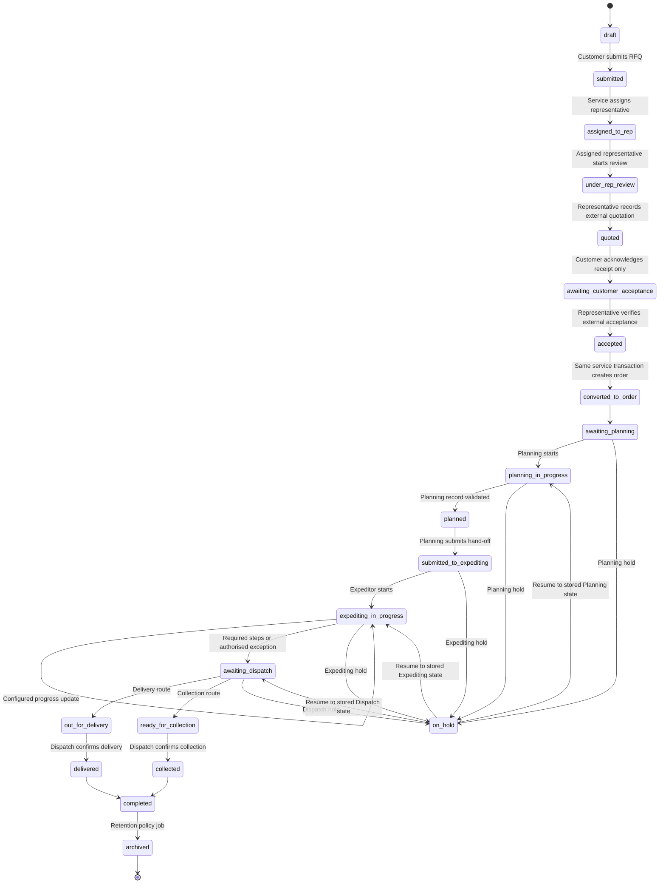

# Order Workflow Implementation Plan

- Status: analysis plus mock workflow Phases 1-5 complete; centralized permissions, representative inbox, quotation, atomic order acceptance and the dedicated Planning workspace are implemented
- Application version reviewed: 2.4.0; workflow implementation updated through 3.1.0
- Reviewed branch: `agent/improve-theme-readability-and-reps`
- Last pushed workflow commit before this phase: `d276488`

## 1. Purpose and scope

This document originally mapped the Rhomberg Test App before implementation. Phase 1 implements the controlled state machine and action boundary. Version 2.6 adds the mock-preview integration slice: separate RFQ/order services, atomic same-browser conversion, immutable order-item snapshots, role-specific Sales/Planning/Expediting/Dispatch workspaces, recipient-scoped notifications and end-to-end integration tests. Version 2.7 centralizes all eight roles, named permissions, navigation metadata and exact operational queue scopes; Buyer remains deliberately inactive. Version 2.8 adds validated RFQ assignment, permanent references, submission snapshots, single-notification routing and a dedicated representative inbox. Version 2.9 adds assigned-representative quotation confirmation, protected evidence metadata, separate internal/customer notes, recipient-specific notifications and customer receipt acknowledgement. Version 3.0 completes the representative `Accept Order` command: validated external evidence, an atomic/idempotent RFQ conversion, permanent linked order and Planning notification. Version 3.1 adds the desktop-responsive Planning queue, complete Planning record, PO-exception control, actor/timestamp audit metadata and recipient-specific Expediting hand-off. The private-cloud backend, durable delivery workers, PDFs and retention remain future phases.

The browser mock is deliberately not a production transaction or security boundary. Its single aggregate workflow write exists to prove UI/service behaviour while PostgreSQL and the authoritative backend remain disconnected.

Implementation details and the authoritative transition flow are documented in `WORKFLOW_STATE_MACHINE.md`.

The analysis preserves these project constraints:

- retain the existing visual design and working GitHub Pages mock preview;
- keep React components independent of browser storage;
- keep mock and future API services interchangeable;
- use shared validation and user-friendly errors;
- enforce company-level access on the server in production;
- create business-history and audit records for important actions;
- introduce no real customer data, credentials, API keys, passwords or pricing data;
- retain current features until an approved replacement is ready.

## 2. Executive summary

The application already has a sound migration boundary. React calls asynchronous services, the GitHub Pages build selects a mock service, and the production build selects an API service. Only the browser-store adapter calls `localStorage`, and the service worker excludes API responses from its cache.

The catalogue, product configurator, RFQ submission screens, customer timeline, internal queue, validation framework, role constants, PDF styling, service error format and company-filtering tests can all be reused.

At the initial analysis, the mock combined enquiries and orders, exposed loose status updates, lacked Sales/Planning/Dispatch journeys, could not convert atomically and had no notification inbox or audit model. Versions 2.5 and 2.6 resolve those issues in the browser mock through the central state machine, separate RFQ/order service resources, role workspaces, audit events and recipient-scoped notifications. Version 2.7 removes component-level role decisions and applies the reusable permission catalogue to workflow actions, service reads and queue navigation. Version 2.8 makes customer submission produce a validated, permanently referenced RFQ in the assigned representative’s dedicated inbox.

Version 2.9 completes the mock quotation-confirmation detail and replaces the obsolete representative-owned acceptance-stage action with a customer receipt acknowledgement that has no commercial acceptance effect. Version 3.0 adds the separate representative confirmation of externally received acceptance and converts the RFQ to one linked order without exposing a direct conversion action. Version 3.1 replaces the small generic Planning card view with a dedicated desktop workspace while retaining the same service, permission, workflow and responsive application architecture. Version 3.2 adds the shared mobile/desktop Expeditor queue, configurable progress model, separate public/internal update content and controlled Dispatch hand-off validation.

The important remaining limitations are:

- the browser aggregate is a same-device demo, not production authentication, concurrency or durability;
- notification delivery attempts, retries and real email remain unimplemented;
- staff branch/team scope is not yet backed by authoritative production assignments;
- order-summary download/email and retention processing are not implemented;
- PostgreSQL/API code remains a reviewed proposal rather than a connected environment.

The private-cloud API and PostgreSQL implementation should follow only after the PDF, notification-delivery and retention contracts are approved and the mock behaviour remains stable.

## 3. Current application architecture

```text
index.html
  -> src/main.jsx
      -> ErrorBoundary
          -> App.jsx (session, view and workflow orchestration)
              -> React screens
              -> services/index.js (GitHub Pages mock build)
              -> services/apiEntry.js (API-only production build)

Mock build                              API-only build
createMockServices                     createApiServices
  -> browserStore                        -> HttpClient
  -> catalogue/reference fixtures        -> /api/v1
  -> RFQ email/PDF test adapters          -> secure cookie + CSRF
  -> same-browser persistence             -> server-authoritative records
```

### 3.1 Build and hosting modes

| Mode | Entry implementation | Persistence | Intended use |
|---|---|---|---|
| GitHub Pages preview | `src/services/index.js` -> `createMockServices()` | Browser store | Public demonstration with fabricated data only |
| Private-cloud candidate | build alias -> `src/services/apiEntry.js` -> `createApiServices()` | Backend API; browser storage only for theme | Future company staging/production |
| Netlify test delivery | Static preview plus `netlify/functions/submit-rfq.mjs` | External email delivery only; not the future system of record | Current protected RFQ-email test path |

`scripts/build-production.mjs` physically excludes mock accounts, public fallback email code, test RFQ markers and source maps from the API-only artifact. This separation should remain.

### 3.2 Navigation and routes

The app does not use a URL router. `App.jsx` stores a `view` string and conditionally renders screens.

| Audience | Current view | Component | Purpose |
|---|---|---|---|
| Everyone | introduction | `Intro` | Opening animation |
| Signed out | authentication | `Auth` | Demo sign-in and customer registration |
| Customer | `home` | `Home` | Customer dashboard and recommended categories |
| Customer | `catalogue` | `Catalogue` | Category/product discovery |
| Customer | `product` | `ProductDetail` | Product information and datasheets |
| Customer | `configurator` | `Configurator` | Guided product configuration |
| Customer | `enquiry` | `Enquiry` | RFQ details, representative, fulfilment and PO |
| Customer | `tracking` | `OrderTracking` | Combined RFQ/order timeline |
| Customer/staff | `account` | `Account` | Profile and visible record history |
| Internal roles | `expeditor` | `ExpeditorDashboard` | Reused internal-card design with service-scoped role queues and permission-filtered actions; Buyer is intentionally empty/read-only |

The internal roles intentionally reuse one visual workspace. `src/domain/accessControl.js` supplies each role's label, copy, default destination and navigation, while the service supplies only authorised records/actions. This avoids duplicating screens without conflating permissions.

### 3.3 Reusable React components

| Component | Reuse assessment |
|---|---|
| `Auth` | Reuse the design and service callbacks. Production onboarding, MFA/SSO and account approval remain backend concerns. |
| `Home` | Reuse. Its activity counts should later use separate enquiry/order summaries. |
| `Catalogue`, `ProductDetail`, `Configurator` | Reuse substantially. They are already service-fed and independent of persistence. |
| `Enquiry` | Reuse for customer RFQ creation. PO timing needs business confirmation because the future workflow says payment/PO occurs after quotation outside the app. |
| `OrderTracking` | Reuse its visual timeline and cards, but feed it separate enquiry/order view models and notification state. |
| `ExpeditorDashboard` | Reused for role-aware queues. Actions now come only from the controlled workflow/permission response. |
| `Account` | Reuse. Later add notification preferences, authorised companies and archived records if approved. |
| `Layout` | Reused header, navigation, notices, toast and theme controls. Navigation now comes from centralized role profiles. |
| `ErrorBoundary` | Reuse. Production monitoring should record only sanitised correlation data. |

### 3.4 Current service contracts

All methods are asynchronous, which is the correct foundation for interchangeable mock/API implementations.

```text
initialize()

auth
  getSession()
  signIn(credentials)
  register(account)
  signOut()
  getDemoLogins()

accounts
  getCurrent()
  getRegistrationOptions()
  listCompanies()

products
  getCatalogue()
  list(filters)
  getById(productId)

enquiries
  list(filters)
  getById(enquiryId)
  getDraft()
  saveDraft(items)
  submit(details, items)

orders
  list(filters)
  getById(orderId)

workflow / tracking compatibility alias
  list(filters)
  getAllowedActions(recordId, entityType)
  performAction(recordId, actionRequest)

audit
  list(filters)

notifications
  list(filters)
  markRead(notificationId)

preferences
  getTheme()
  setTheme(theme)
```

The future workflow should extend this boundary rather than allowing new screens to call fetch, email, PDF or storage code directly.

### 3.5 Current domain and supporting modules

| Area | Current module | Notes |
|---|---|---|
| Product rules | `src/domain/productConfiguration.js` | Reusable conditional-field and option logic |
| Tracking statuses | `src/domain/tracking.js` | Reusable labels/progress concept; status list and free advancement need replacement |
| Shared validation | `src/services/validation.js` | Reusable error format; needs workflow-specific validators |
| Roles/permissions | `src/services/contracts.js`, `src/domain/accessControl.js` | Central named permission catalogue, role grants, navigation profiles and exact queue predicates |
| Product catalogue | `src/data/catalogue.js` | 8 categories and 82 current product/product-family records |
| Branch/rep fixtures | `src/data/branches.js`, `src/data/representatives.js` | Useful in mock mode only; production master data must come from approved sources |
| RFQ PDF | `src/lib/rfqPdf.js` | Visual layout can seed an unpriced order-summary template |
| RFQ email | `src/lib/rfqEmail.js` | Demo/test delivery only; not suitable as the production notification service |
| Protected email test | `netlify/functions/submit-rfq.mjs` | Current test adapter, not the private-cloud workflow API |
| Service worker | `sw.js` | Reusable; already avoids caching `/api/` responses |

## 4. Current models and mock-data structures

### 4.1 Account

```text
id, companyId, company, contact, email, phone, area, industry,
role, permissions, createdAt
```

The mock persistence record also contains a fabricated plaintext demo password. `toPublicAccount()` removes it before the account reaches React state. Production must never store or return a plaintext password.

### 4.2 Enquiry

```text
id, reference, version, accountId, companyId,
company/contact/email/phone display snapshots,
area, application, medium, emergency,
fulfilment, deliveryAddress, collectionBranch, notes,
poMode, poNumber, poFileName,
selectedRep, items,
trackingStatus, status, trackingHistory,
email-delivery metadata,
createdAt, updatedAt
```

The enquiry currently becomes order-like when its `trackingStatus` reaches `po-received`. There is no separate order object in mock mode.

### 4.3 Configured enquiry item

```text
lineId, productId, code, name, description/image snapshots,
category, variant, quantity, configuration, updatedAt
```

Product-specific configuration is correctly represented as a flexible object and revalidated against the authoritative product definition inside the service.

### 4.4 Tracking event

```text
id, status, note, actor, createdAt
```

The event lacks actor ID, actor role, company ID, visibility, previous state, entity type, request/correlation ID, outcome and immutable audit metadata.

### 4.5 Product

Products contain stable IDs/codes, category, specification snapshots, configuration-field schemas, datasheets and business rules. The existing configuration engine supports choice, multi-choice, select, text, textarea and toggle inputs with conditional visibility and dependent options.

### 4.6 Remaining mock-model gaps

The mock now models separate RFQs/orders/items, quotation confirmation, Planning and Expediting detail, Dispatch handoffs, in-app notifications and workflow/audit history. It intentionally does not yet model:

- durable notification/email delivery attempts and retries;
- protected quotation/document byte storage or malware scanning;
- generated order summaries;
- retention policies and archive jobs;
- production-grade append-only audit storage;
- authoritative staff branch/team scope beyond the current role and assignment fixtures.

## 5. Browser-storage dependency audit

### 5.1 Direct dependencies

Only `src/services/browserStore.js` accesses `globalThis.localStorage`. No React component accesses `localStorage`, `sessionStorage`, IndexedDB or cookies directly.

Current mock keys are:

| Key purpose | Current key |
|---|---|
| Accounts | `rhombergPreviewAccountsV2` |
| Session | `rhombergPreviewSessionV2` |
| Per-account RFQ drafts | `rhombergPreviewDraftV2` |
| Atomic RFQ/order workflow aggregate | `rhombergPreviewWorkflowStateV1` |
| Audit history | `rhombergPreviewAuditV1` |
| Recipient notifications | `rhombergPreviewNotificationsV1` |
| Theme preference | `rhombergPreviewThemeV1` |
| Demo seed version | `rhombergPreviewSeedV11` |

Legacy V1 and combined V2 enquiry keys are read during mock initialisation. Combined records are normalised and partitioned into the aggregate's RFQ/order arrays without clearing existing demo records.

### 5.2 API-mode browser storage

`createApiServices()` uses the browser-store adapter only for the non-sensitive theme preference. Authentication is designed for secure server cookies, not Web Storage.

### 5.3 Cache Storage

`sw.js` uses the browser Cache API for the public application shell and assets. It explicitly bypasses `/api/` requests and fetches runtime configuration network-first. Cache Storage is not used for accounts, RFQs, orders or documents.

### 5.4 Storage implications for future phases

- Add new mock persistence only inside `createMockServices()` or a mock repository used by it.
- Version and migrate the mock schema; do not silently discard existing preview RFQs.
- Store order, notification and audit fixtures under separate keys or a versioned aggregate store.
- Never persist uploaded document bytes or real customer information in the public preview.
- Continue testing that React contains no storage imports or direct storage calls.

## 6. Current access control and company isolation

### 6.1 Existing safeguards

- Customers receive RFQs and orders only when the record `companyId` matches the authorised account.
- Direct access to another mock company RFQ or order returns a not-found error.
- Customer draft data is keyed by account.
- Sales representatives receive only records matching their authoritative `representativeId`.
- Planning, Expediting and Dispatch use separate order records and controlled action sets.
- Notifications are filtered by company, role and representative recipient, with independent per-user read state.
- The proposed PostgreSQL schema includes `user_company_access`, representative assignments and row-level security.
- The API client uses cookies, CSRF, request IDs, idempotency keys and structured errors.

### 6.2 Important limitations

- Browser mock isolation is demonstrative, not security. Anyone controlling the browser can alter stored data.
- The customer filter in `App.jsx` is only a display safeguard; production enforcement must occur in every server query.
- Planning, Expediting and Dispatch are national test roles in mock mode; exact stage queues are enforced, but production branch/team scope still needs an approved assignment model.
- The proposed RLS helpers now mirror exact role queues and permission grants; IT must still review and test them before implementation.
- A sales representative cannot currently retrieve assigned companies through `accounts.listCompanies()` unless separately granted broad company-read permission.
- The mock derives workflow actor identity from the signed-in service session. The production API must do the same and never trust browser-supplied actor/role fields.
- Document and PDF authorisation are proposed but not wired into the interface or service layer.

## 7. Current statuses compared with the required workflow

Legacy pre-2.5 UI statuses retained only for migration:

```text
rfq-submitted -> under-review -> quotation-sent -> po-received -> scheduled
-> in-production -> quality-check -> ready -> dispatched -> completed

on-hold is also selectable at any time
```

The current `nextTrackingStatus()` suggests a linear path, but the internal screen also exposes every status in a dropdown. The service checks only whether a status ID exists; it does not enforce the previous state, role, fulfilment method or required data.

| Current status/capability | Fit with required workflow | Conflict or gap |
|---|---|---|
| `rfq-submitted` | Direct match | No assigned-rep notification history |
| `under-review` | Reusable | Ownership is not restricted to the assigned rep |
| `quotation-sent` | Legacy migration source for "Quoted" | Version 2.9 replaces this old capability with assigned-representative confirmation metadata, notifications and customer receipt acknowledgement |
| `po-received` | Partial match | Conflates external customer commitment, rep acceptance, RFQ conversion and order creation |
| `scheduled` | Partial match | Skips Planning, internal job number, customer PO capture and handoff to Expediting |
| `in-production` | Reusable | No configured production-stage model or partial-line handling |
| `quality-check` | Reusable | Role ownership and entry/exit guards are undefined |
| `ready` | Ambiguous | Does not distinguish ready for Dispatch, ready for delivery or ready for collection |
| `dispatched` | Delivery only | No collection path, delivery confirmation or completion evidence |
| `completed` | Reusable terminal state | No retention/archive lifecycle |
| `on-hold` | Useful exception state | No reason code, owner, resume target or permission rules |
| Generic status update | Not safe for production | Allows skipping, regression and role bypass |

Required states not represented clearly include:

- order accepted by the representative;
- RFQ converted to a distinct order;
- Planning pending/in progress;
- ready for Expediting / handed to Expediting;
- ready for Dispatch;
- ready for collection and collected;
- delivered;
- archived;
- cancelled/expired paths in the current UI;
- notification pending/sent/failed state separate from business state.

## 8. Proposed state-transition model

The server must own the state machine. The UI should receive allowed actions and should never manufacture the next status itself.



The top-level order status stays `expediting_in_progress` while configured production/fulfilment updates are appended. The separate progress-step record carries `materials_checked`, `production_started`, `quality_check` and the other approved milestones without multiplying the main order-state machine.

### 8.1 Transition invariants

Every successful workflow action should commit atomically:

1. the entity state/version change;
2. an immutable business workflow event;
3. an immutable security/audit event;
4. required notification-outbox records.

If any required database write fails, the transition should roll back. Notification delivery itself is asynchronous; a temporary email failure must not reverse the business transition.

Every transition request should include an idempotency key and expected entity version. The server derives actor, role, company scope and representative assignment from the authenticated session.

### 8.2 Proposed transition ownership

| Action | Proposed owner | Required guard |
|---|---|---|
| Submit RFQ | Customer | Own authorised company; valid configuration; assigned active representative |
| Start review | Assigned sales representative | Active representative-company assignment |
| Mark quoted | Assigned sales representative | Current state under review; external send date/reference recorded |
| Accept order and convert | Assigned sales representative or approved manager through one service command | Current state awaiting customer acceptance; approved evidence recorded; no pricing/payment secrets; server creates one immutable linked order |
| Add job/PO numbers | Planning capability | Order in Planning; required identifiers valid and unique according to policy |
| Submit to Expediting | Planning capability | Required Planning fields complete |
| Update production/fulfilment | Expeditor capability | Allowed transition from current state; scoped queue access |
| Confirm dispatch/collection/delivery | Dispatch capability | Correct fulfilment route and preceding state |
| Archive | Scheduled retention worker or Administrator | Terminal state, retention elapsed, no legal hold |
| Download/email summary PDF | Authorised internal capability | Entity scope check; audit event; no pricing/customer secrets beyond approved summary fields |

## 9. Recommended service-layer evolution

Keep the existing services and add intent-specific methods. Avoid a generic UI-controlled `updateStatus()` for production workflow actions.

```text
auth
  existing methods
  getEffectivePermissions()

accounts
  existing methods
  listAuthorisedCompanies()
  listAssignableRepresentatives(companyId)

enquiries
  existing draft/submit/read methods
  getAllowedActions(enquiryId)
  startReview(enquiryId, expectedVersion)
  markQuoted(enquiryId, quotationMetadata, expectedVersion)
  acceptOrder(enquiryId, acceptanceMetadata, expectedVersion) -> converted RFQ + linked order
  placeOnHold()/resume()/cancel()

orders (new)
  list(filters)
  getById(orderId)
  getAllowedActions(orderId)
  savePlanning(orderId, planningData, expectedVersion)
  submitToExpediting(orderId, expectedVersion)
  transition(orderId, action, note, expectedVersion)
  placeOnHold()/resume()/cancel()

workflowHistory (new)
  listForEnquiry(enquiryId)
  listForOrder(orderId)

notifications (new)
  list(filters)
  getUnreadCount()
  markRead(notificationId)

documents (new)
  listForEntity(entityType, entityId)
  downloadOrderSummary(orderId)
  emailOrderSummary(orderId, recipientPolicy)

audit (new; authorised internal use only)
  list(filters)
  getForEntity(entityType, entityId)
```

Mock and API implementations must return the same shapes. Mock services should generate fabricated notifications and audit events; API services should delegate enforcement and persistence to the backend.

## 10. Safe implementation phases

### Phase 0 - Analysis and decisions (analysis complete)

- approve this architecture/gap analysis;
- confirm roles, statuses, required identifiers, notification channels and retention rules;
- make no runtime changes.

Exit gate: business owner and IT agree on the state names, transition owners and data classification.

### Phase 1 - Domain state machine, permissions and audit contract (complete)

- replace the loose status list with enquiry/order state definitions and allowed transitions;
- add workflow action permissions without changing visible screens;
- define workflow-event, audit-event and notification models;
- add shared validators for each intent-specific action;
- add mock schema version/migration support;
- add transition-matrix and denied-transition tests;
- update architecture, API and security documentation.

Exit gate: domain tests prove roles cannot skip or perform another role's transitions.

### Phase 2 - Separate mock enquiries and orders (mock-preview core complete)

- add interchangeable `orders`, `workflowHistory`, `notifications` and `audit` services;
- migrate current combined mock records without losing the GitHub Pages demo;
- create an order/item snapshot only through an atomic conversion method;
- adapt customer tracking through a compatibility view model so the design remains unchanged;
- add isolation tests for enquiry, order, event, notification and document records.

Exit gate: all existing customer demo paths work, while enquiry/order records are distinct internally.

### Phase 3 - Sales representative quotation workflow (mock happy path complete)

- add assigned-representative queue using the existing internal-card design;
- add start-review and mark-quoted actions;
- require quotation number/date, an explicit expiry rule and optional Outlook-email confirmation;
- keep optional internal and customer-facing notes separate;
- record optional quotation evidence as metadata only in mock mode, private by default;
- record only external Outlook metadata, not quotation pricing or message credentials;
- create customer and representative notification entries;
- allow the authorised company customer to acknowledge receipt without accepting price, confirming payment/PO or creating an order;
- add visible timeline events and internal audit events;
- test assignment/company isolation, required fields, note projection, evidence visibility, invalid transitions and customer acknowledgement.

Exit gate: only the assigned/authorised representative can mark the RFQ quoted, the customer sees only authorised quotation information, and receipt acknowledgement produces an audit/representative notification without creating an order.

### Phase 4 - Acceptance, conversion and Planning (complete in mock/API contract)

- capture the approved acceptance type, conditional PO/payment reference, date, internal verification note and optional private document metadata;
- reject pricing, payment-card, banking and password fields;
- expose only `accept_order` to the representative and keep `convert_to_order` internal;
- convert the accepted RFQ to exactly one order through an atomic/idempotent service operation;
- preserve the historical RFQ and link the permanent order reference;
- copy company/customer/representative references and immutable configured line-item snapshots;
- add a desktop-optimised, responsive Planning queue/workspace with search, stage/priority filters, sorting and complete order context;
- capture internal job number, customer PO or authorised exception, Planning notes, schedule, assigned Planning user, production location, priority, submission date and document references;
- validate the assigned representative, service-owned user/location, dates, priority, required identifiers and persisted Planning record before submitting the order to Expediting;
- record Planning actors/timestamps and notify the customer, assigned representative and Expeditor with role-appropriate wording;
- remove all internal Planning data from customer projections;
- audit acceptance, conversion and order creation and notify the customer, assigned representative and Planning.

Exit gate: tests prove required/conditional evidence, assigned-representative scope, sensitive-data rejection, one-order idempotency, customer-safe projection and Planning routing; Expediting cannot receive an incomplete Planning record.

### Phase 5 - Expediting (version 3.2 complete in mock/API contract); Dispatch workspace remains next

- provide one responsive Expeditor workspace with new/in-progress/hold/due-soon/awaiting-Dispatch/priority views;
- default to oldest-update-first and search customer, representative, RFQ, order, job and PO references;
- load configured production/fulfilment steps and Dispatch requirements through an interchangeable `expediting` service;
- implement controlled Start, Progress Update, Hold, Resume and Dispatch Hand-off actions;
- store the customer message separately from the optional internal note, estimate, delay reason and document/image reference metadata;
- notify customer and assigned representative after every approved customer-visible update;
- place the same public update in customer and representative timelines while removing internal notes and exception evidence from customer projections;
- require the configured completion steps before Dispatch, or capture a controlled authorised exception reason/reference;
- keep handed-off orders visible read-only to Expediting while `awaiting_dispatch`;
- retain the existing separate Dispatch queue/actions for delivery and collection until its dedicated workspace phase;
- cover permission, visibility, holds, resume, transition order, required-step/exception and API normalisation behavior.

Exit gate: the Expeditor happy path, hold/resume path, required-step and authorised-exception hand-offs pass role, state, company-isolation, notification, customer-projection and API-adapter tests.

### Role and permission integration (version 2.7 complete)

- define all requested capability codes once and grant them through one role matrix;
- make every workflow transition require its named permission;
- centralize role dashboards, default destinations and navigation metadata;
- enforce own-company, assigned-record and exact operational queue scopes in the service;
- prepare Buyer as authenticated but operationally inactive;
- add Manager/Administrator oversight identities and permission/isolation/audit tests;
- update API and PostgreSQL permission/RLS proposals.

Exit gate: components contain no direct role equality decisions, Buyer cannot discover operational records, and every active queue is limited to its responsible stages.

### RFQ assignment and representative inbox (version 2.8 complete)

- validate the signed-in customer/company at the service boundary;
- canonicalize the selected representative through the approved area directory;
- allocate and preserve a permanent mock RFQ reference;
- store submission/assignment times, configured items, notes, priority, customer/company snapshots and safe document metadata;
- make submission the first audit/history entry and assignment the single representative notification;
- expose assigned RFQs through a dedicated mock/API service method;
- add the required Sales inbox groups, search, priority, age, emergency, last-activity and open-RFQ presentation;
- expose `Start Review` only for an assigned representative while the RFQ is `assigned_to_rep`;
- retain later quotation, acceptance and conversion actions through a reusable workflow panel.

Exit gate: submission and inbox tests prove company/representative validation, one notification, assignment isolation, permanent reference retention and the controlled Start Review transition.

### Quotation confirmation and receipt acknowledgement (version 2.9 complete)

- expose `Mark as Quoted` only from `under_rep_review` to the assigned representative or an explicitly authorised management role;
- validate quotation number/date/expiry and reject pricing keys;
- record the representative/timestamp plus separate internal/customer notes;
- store file metadata only in mock mode and require explicit customer-visibility authorisation;
- create distinct customer and representative confirmation notifications;
- expose `I received the quotation` only to an authorised company customer from `quoted`;
- record acknowledgement actor/time, audit the action and notify the assigned representative;
- preserve the later external acceptance as a separate representative action from customer receipt acknowledgement.

Exit gate: tests prove metadata/assignment/company rules, note and document projection, recipient-specific notifications, and that acknowledgement neither confirms a commercial commitment nor creates an order.

### Phase 6 - PDFs, notification delivery and retention

- adapt the existing PDF styling to an approved unpriced order summary;
- provide authorised internal download and email actions through services;
- record PDF generation, download and email audit events;
- implement notification outbox/retry status;
- implement configurable retention, archive jobs, legal hold and archived-record queries;
- preserve active/completed customer views while hiding archived records by default.

Exit gate: documents never bypass scope checks, delivery failures are retryable, and retention tests prove no premature deletion.

### Phase 7 - Private-cloud API and PostgreSQL staging implementation

- implement the approved database migration and endpoints;
- keep GitHub Pages on mock services;
- implement branch/company scopes and row-level security;
- add object storage, malware scanning, email worker, audit sink and scheduled retention worker;
- run API contract tests against both mock and staging adapters;
- import only approved synthetic staging data.

Exit gate: penetration/isolation, backup/restore, email, upload and audit tests pass in a non-production environment.

### Phase 8 - Controlled pilot and production readiness

- perform user acceptance with Customer, Sales, Planning, Expediting and Dispatch representatives;
- validate accessibility, mobile responsiveness and performance;
- complete monitoring, alerting, runbooks, recovery rehearsal and security approval;
- deploy the same reviewed API-only artifact through the company pipeline.

Exit gate: signed business/IT approval and rollback plan.

After each phase run, at minimum:

```text
npm test
npm run check
npm run check:css
npm run build:netlify
npm run build:production
```

Add phase-specific transition, role, company-isolation, audit and API contract tests before declaring that phase complete.

## 11. Proposed database changes

The current SQL proposal already includes companies, branches, users, user-company access, representatives, representative assignments, product categories, products, enquiries, enquiry items, orders, tracking events, documents, drafts, sessions, idempotency, email outbox and audit events. The following changes are still required.

| Area | Required change |
|---|---|
| Roles/capabilities | Decide whether Planning and Dispatch are new roles or permissions assigned to existing staff roles. Prefer permission grants plus branch/team scopes if users may perform multiple functions. |
| Enquiry statuses | Add/confirm accepted, on-hold, cancelled/expired and converted states. Store hold reason and resume target separately. |
| Order statuses | Add Planning pending/in-progress, ready for Expediting, Expediting, ready for Dispatch, ready for collection, collected and delivered states. |
| Transition rules | Add a versioned workflow-definition/transition table or enforce an equivalent versioned server policy. Do not rely only on database enums. |
| Order items | Add immutable `order_items` snapshots. An order should not depend on mutable enquiry/product configuration after conversion. |
| Quotation metadata | Review the proposed `app.quotations` table: number/date/expiry rule, marked-by/time, separate notes, email confirmation, acknowledgement actor/time and customer-authorised evidence metadata. Store no pricing in this project. |
| Planning | Proposed SQL now includes job/PO or authorised exception, notes, schedule, owner, branch, priority, document references and actor/timestamps. IT must still approve identifier uniqueness/format and who may authorise a PO exception. |
| Expediting | Add server-owned progress-step configuration, structured update rows, public/internal message separation, estimate/delay fields, metadata references, updater/timestamp and controlled hand-off exception evidence. |
| Assignment/scope | Add staff branch/team scope tables for Planning, Expediting, Buyer and Dispatch. Update RLS so broad roles do not automatically see every company. |
| Workflow events | Replace/extend `tracking_events` with entity type, previous/new state, action code, actor ID/role, customer visibility, internal note, public note, request ID and event version. |
| Notifications | Add notification records, recipients, channels, read state, outbox jobs, attempts and failure codes. Use user/company/representative IDs, not untrusted addresses from the client. |
| Documents | Add generated-document metadata and purpose. Keep bytes in private object storage; audit generation/download/email. |
| Order summaries | Add generated artifact hash/template version and expiry if summaries are stored. Do not persist pricing content. |
| Audit | Extend `audit_events` with actor role, entity company, before/after state or safe change summary, correlation/idempotency keys and append-only controls. |
| Concurrency | Continue using `row_version`; require expected version for workflow mutations. |
| Archiving | Add `archived_at`, `archive_reason`, `retention_policy_id`, `eligible_for_archive_at`, `legal_hold_at/by/reason` and archive job history. |
| Retention policy | Add configurable policy records by entity/document kind, with effective dates and audit history. |
| Email metadata | Extend outbox templates/events for rep assignment, quoted, order accepted, Planning handoff, stage update, dispatch and archive notifications. |
| Indexes | Add queue indexes by state, branch/team, representative and oldest update; unread notification indexes; archive eligibility indexes. |
| RLS | Apply company predicates to every child/event/notification/document query and separate staff operational scope from general company access. |

## 12. Proposed API changes

Existing authentication, catalogue, draft, enquiry, order-read, document and generic tracking endpoints provide a base. Future mutation endpoints should express business intent and return the updated entity, new event, queued notifications, allowed next actions and entity version.

| Endpoint | Purpose | Important request/response fields |
|---|---|---|
| `GET /enquiries/inbox` | Assigned representative RFQ inbox | Group, priority and search filters; server derives representative identity |
| `GET /enquiries/{id}/allowed-actions` | Render only authorised rep/customer actions | Response: action codes, required fields, current version |
| `POST /enquiries/{id}/actions/start-review` | Assigned rep starts review | Request: expected version; actor derived from session |
| `POST /enquiries/{id}/actions/mark-quoted` | Rep confirms external Outlook send | Request: number, date, expiry rule/date, optional email confirmation, separate notes/evidence, expected version; no pricing |
| `POST /enquiries/{id}/actions/acknowledge-quotation` | Customer confirms receipt only | Request: expected version; company/actor from session; response must not create an order |
| `POST /enquiries/{id}/actions/accept-order` | Rep confirms external acceptance and atomically converts it | Request: acceptance type/date/note/verification, conditional PO/payment reference, optional private document, expected version; response: converted RFQ plus one linked `awaiting_planning` order; no pricing/payment secrets |
| `POST /enquiries/{id}/actions/hold|resume|cancel` | Controlled exceptions | Reason code, note, resume target where applicable, expected version |
| `GET /orders?queue=planning|expediting|dispatch` | Role/scoped queues | Server ignores unauthorised company/branch broadening filters |
| `GET /planning/workspace-options` | Service-owned Planning users, locations and priorities | Requires `add_planning_information`; never accepts arbitrary browser-created identities |
| `GET /expediting/workspace-options` | Server-owned progress steps, required hand-off subset, metadata types and due-soon policy | Requires Expediting queue or action permission; client labels and required flags are not authoritative |
| `GET /orders/{id}/allowed-actions` | Role/state-aware actions | Action codes, guards and current version |
| `POST /orders/{id}/workflow-actions` with `complete_planning` | Structured Planning record | Job, PO/exception, notes, dates, owner, location, priority, references, submission date and expected version |
| `POST /orders/{id}/workflow-actions` with `submit_to_expediting` | Planning handoff | Revalidates persisted plan/rep; returns updated order and queues customer/rep/Expeditor notifications |
| `POST /orders/{id}/workflow-actions` with `start_expediting` | Accept planned order into Expediting | Requires `planning_received`, public message and expected version |
| `POST /orders/{id}/workflow-actions` with `add_expediting_update` | Append same-status progress | Configured step, public message, optional internal note/estimate/delay/reference metadata and expected version |
| `POST /orders/{id}/workflow-actions` with `place_on_hold` or `resume_order` | Controlled Expediting pause/resume | Public message, required hold reason, resume step and expected version |
| `POST /orders/{id}/workflow-actions` with `complete_expediting` | Dispatch hand-off | Requires `ready_for_dispatch`, completion check and all required steps, or authorised exception reason/reference |
| `POST /orders/{id}/actions/{actionCode}` | Approved fulfilment transition | Public note, optional internal note, expected version; server validates action |
| `POST /orders/{id}/actions/confirm-dispatch` | Dispatch route | Delivery/collection method, approved reference/evidence metadata, expected version |
| `GET /enquiries/{id}/history` | Authorised RFQ business timeline | Visibility-filtered events |
| `GET /orders/{id}/history` | Authorised order business timeline | Visibility-filtered events |
| `GET /notifications` | User notification inbox | Unread/status/entity filters; company scope from session |
| `POST /notifications/{id}/read` | Mark one notification read | Idempotent response |
| `GET /orders/{id}/summary.pdf` | Authorised unpriced PDF download | PDF stream; audited; `Cache-Control: no-store` |
| `POST /orders/{id}/summary-email` | Email summary to an approved recipient policy | Server resolves recipients; queued delivery response |
| `GET /audit-events` | Manager/admin audit review | Strict scopes, pagination and redaction |
| `GET/PATCH /admin/retention-policies` | Configure retention | Administrator only; every change audited |
| `POST /orders/{id}/archive|restore` | Exceptional manual archive control | Administrator/approved manager; legal-hold guard |

All state-changing endpoints require CSRF protection, idempotency keys, expected versions and an authenticated server session. Out-of-scope entity IDs return `404`; invalid role/state combinations return a safe `409` or `422` with a stable error code and allowed actions.

The OpenAPI specification should be updated in the same phase as each service-contract change, never afterwards.

## 13. Audit-history requirements

Business history and security audit have different audiences and should not be the same record.

### 13.1 Customer/business timeline

Customer-visible events may include:

- RFQ submitted;
- quotation sent;
- order accepted/created;
- approved fulfilment-stage updates;
- ready for collection, dispatched, delivered, collected or completed;
- approved hold/resume messages.

Internal notes, access denials, email addresses, IP data, pricing references and administrative details must never appear in this timeline.

### 13.2 Internal append-only audit

Record at minimum:

- sign-in success/failure, sign-out, session revocation and account creation;
- role, permission, company access, branch scope and representative assignment changes;
- RFQ submit, representative assignment/reassignment and document upload;
- start review, mark quoted, notification queue/delivery/failure;
- order acceptance and RFQ-to-order conversion;
- Planning field edits and handoff;
- every order transition, hold, resume, cancellation and dispatch confirmation;
- PDF generation, download and email;
- archive eligibility, archive, legal hold, restore and deletion;
- administrative product/workflow/retention changes;
- denied attempts to access another company or perform an unauthorised transition.

Do not audit every draft keystroke. If draft history is required, use a separate version mechanism to prevent the security audit from becoming noisy.

## 14. Security and data-isolation risks

| Risk | Current exposure | Required mitigation |
|---|---|---|
| Mock data treated as secure | Browser users can inspect/change local records | Keep fabricated data and visible preview warnings; never use mock mode for production |
| Plaintext demo passwords | Present only in mock seed/browser storage | Physically exclude mock modules from production build; hash production credentials server-side or use SSO |
| Cross-company ID access | React filtering is not authorisation | Scope every server query by session-derived authorised company IDs; RLS as defence in depth |
| Broad staff access | Mock exact-stage queues exist, but production branch/team/portfolio assignments are not authoritative yet | Add approved assignment tables in addition to the explicit permissions and queue RLS predicates |
| Arbitrary status changes | Browser mock is controlled; the future backend is not implemented | Reproduce the server-owned action/permission/state/fulfilment guards transactionally |
| Client-supplied actor | Current adapters derive the actor from the signed-in service/API session contract | Keep ignoring actor/role fields from request bodies and verify server session context |
| Rep routing | Current test email is not routed from an authoritative rep email record | Resolve active rep assignment and notification recipient server-side |
| Third-party public email fallback | Test RFQ data may pass through a public delivery service | Fabricated data only in preview; remove/disable fallback in private-cloud build |
| PO/document access | Future files could be vulnerable to IDOR or malicious uploads | Private object storage, signature/MIME/size checks, malware scan, short-lived URLs and per-download scope check |
| Notification leakage | Email/in-app recipients may be selected incorrectly | Resolve recipients from authorised relationships; store delivery/audit metadata |
| PDF leakage | Summary may expose another company or internal fields | Generate server-side after scope check, approved template/field allowlist, no pricing, audit every action |
| Audit tampering | Current `trackingHistory` is mutable application data | Append-only audit store, restricted database grants and optional external log sink |
| Concurrent staff actions | Current mock uses last write wins | Expected row version, transaction locks and conflict messages |
| Retention mistakes | No archive/legal-hold model | Versioned policies, dry-run reporting, legal hold and restore tests |
| Service-worker data cache | Authenticated data could be cached accidentally | Retain `/api/` bypass and `no-store` headers; add automated cache-policy tests |
| Real data in public preview | Public repository/Pages could expose company or customer records | Synthetic fixtures only; automated secret/data-pattern scans before publish |

## 15. Business decisions and remaining clarifications

1. Are Planning and Dispatch separate application roles, or permissions assigned to Buyer, Expeditor, Manager or other staff accounts?
2. Can one staff member hold multiple operational capabilities?
3. Which branches/companies may each internal role see, and who manages those assignments?
4. Must the selected sales representative be fixed at RFQ submission, or may a manager reassign it?
5. Decision recorded in version 2.9: quotation number and quotation date are required; expiry rule/date are validated; Outlook email confirmation, separate notes and document/reference evidence are optional.
6. Should the app notify the customer by email, in-app notification, both, or a configurable preference?
7. Decision recorded in version 2.9: the customer may acknowledge receipt, but this is not price acceptance, payment/PO confirmation or order creation.
8. Decision recorded in version 3.0: accepted evidence types are Purchase Order received, payment confirmed externally, written acceptance, account-customer authorisation or another approved instruction; the representative must verify it.
9. Should the current customer PO-number/upload option remain at RFQ submission, become optional supporting data, or move entirely to the post-quotation process?
10. May a representative correct PO details after acceptance, and who must approve the change?
11. Decision recorded in version 3.0: representative acceptance immediately performs the internal conversion as one atomic command; there is no browser-visible conversion gate.
12. What format and uniqueness rules apply to order number, internal job number and customer PO number? Which system is authoritative?
13. Will an ERP or accounting system eventually create or own the order/job number?
14. Approve the proposed Expediting starting stages and required-for-Dispatch subset. Must future stage sets vary by product family, production location or fulfilment route?
15. Must progress be tracked per order, per order item or per quantity batch?
16. Are partial production, partial delivery and split collection required?
17. Which notes are customer-visible, representative-visible or internal-only?
18. Who may place an RFQ/order on hold, resume it, cancel it or move it backwards?
19. What are the delivery and collection confirmation requirements: courier reference, recipient, signature/proof document or simple confirmation?
20. What information belongs in the order-summary PDF, and which internal roles may download or email it?
21. Must an emailed summary be limited to the assigned representative/customer contacts or may staff type another address?
22. What retention periods apply to RFQs, orders, audit records, emails, notifications and uploaded/generated documents?
23. Are there legal-hold, warranty, tax or quality-record requirements that override normal retention?
24. Can archived records remain visible to customers, or only to authorised internal users?
25. What customer notification should be sent when email delivery fails but the workflow transition succeeds?
26. What SLA/escalation rules apply when the assigned representative, Planning, Expediting or Dispatch does not act within a target period?
27. Are emergency orders allowed to bypass any stage? Recommended answer: no bypass without an explicit audited override policy.

## 16. Recommended next phase

Continue with the next approved operational-workspace prompt, expected to be the dedicated Dispatch experience, using the same queue/action/service pattern. Do not begin production integration. Phase 6 PDFs, durable notification delivery and retention still require owner approval of summary fields, recipients, retry policy and legal-hold rules.

## 17. Current-phase verification

After every implementation slice run:

- service/mock/API contract tests;
- React compile check;
- stylesheet compile check;
- GitHub Pages mock build;
- API-only production build and mock-marker scan;
- direct-storage boundary scan;
- Git whitespace check.
