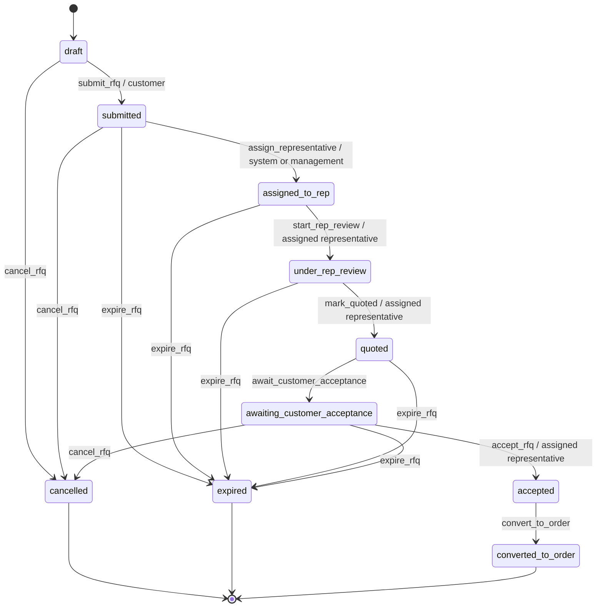
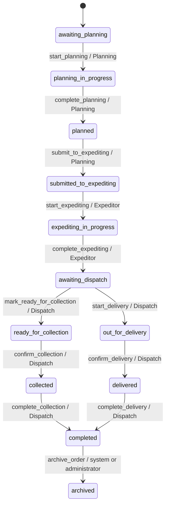

# RFQ and order workflow state machine

Status: implemented in mock-preview and API adapter layers; the private-cloud backend remains proposed.

## Source of truth

`src/domain/workflow.js` is the only module that decides whether an RFQ or order may change status. It defines:

- all RFQ and order status IDs;
- human-readable labels plus customer and internal descriptions;
- customer visibility and progress metadata;
- actions available from each status;
- roles, required fields, comments, notifications and timestamp fields for each action;
- representative-assignment, accepted-order, fulfilment and hold/resume guards;
- controlled management overrides;
- workflow-event and audit-event creation.

React never sends a target status. It renders the `allowedWorkflowActions` returned by the service and submits an action code. The mock service calls the domain validator locally; the future API must run the same rules authoritatively on the server.

```text
React screen
  -> workflow.performAction(recordId, action request)
      -> service authorises record scope
          -> workflow validator checks state + role + assignment + fields + version
              -> atomic record update + workflow event + audit event + notification outbox item
```

## RFQ flow



### RFQ transition contract

| Action | From -> to | Permitted roles | Required data | Comment | Notify | Timestamp |
|---|---|---|---|---:|---:|---|
| `submit_rfq` | `draft` -> `submitted` | Customer | company, application, configured units | No | Yes | `submittedAt` |
| `assign_representative` | `submitted` -> `assigned_to_rep` | System, manager, administrator | selected representative | No | Yes | `assignedAt` |
| `start_rep_review` | `assigned_to_rep` -> `under_rep_review` | Assigned sales representative, manager, administrator | assignment match for representative | No | No | `reviewStartedAt` |
| `mark_quoted` | `under_rep_review` -> `quoted` | Assigned sales representative, manager, administrator | `quotationSentAt` | No | Yes | `quotedAt` |
| `await_customer_acceptance` | `quoted` -> `awaiting_customer_acceptance` | System, assigned sales representative, manager, administrator | assignment match for representative | No | No | `awaitingAcceptanceAt` |
| `accept_rfq` | `awaiting_customer_acceptance` -> `accepted` | Assigned sales representative, manager, administrator | `acceptanceBasis` | Yes | Yes | `acceptedAt` |
| `convert_to_order` | `accepted` -> `converted_to_order` | System, assigned sales representative, manager, administrator | created `orderId` | No | Yes | `convertedToOrderAt` |
| `cancel_rfq` | eligible non-terminal RFQ -> `cancelled` | Customer only at approved external stages; otherwise manager or administrator | none | Yes | Yes | `cancelledAt` |
| `expire_rfq` | active submitted RFQ -> `expired` | System, manager, administrator | none | Yes | Yes | `expiredAt` |

The future backend must create the order and perform `convert_to_order` in one database transaction. The current phase controls the transition contract but intentionally does not implement a production order-conversion transaction.

## Order flow



### Order transition contract

| Action | From -> to | Permitted roles | Required data/guard | Comment | Notify | Timestamp |
|---|---|---|---|---:|---:|---|
| `start_planning` | `awaiting_planning` -> `planning_in_progress` | Planning, manager, administrator | source RFQ converted and `acceptedAt` present | No | No | `planningStartedAt` |
| `complete_planning` | `planning_in_progress` -> `planned` | Planning, manager, administrator | `internalJobNumber`, `customerPoNumber` | No | No | `plannedAt` |
| `submit_to_expediting` | `planned` -> `submitted_to_expediting` | Planning, manager, administrator | both planning references persisted | No | Yes | `submittedToExpeditingAt` |
| `start_expediting` | `submitted_to_expediting` -> `expediting_in_progress` | Expeditor, manager, administrator | exact handoff status | No | Yes | `expeditingStartedAt` |
| `complete_expediting` | `expediting_in_progress` -> `awaiting_dispatch` | Expeditor, manager, administrator | completion check confirmed | Yes | Yes | `submittedToDispatchAt` |
| `mark_ready_for_collection` | `awaiting_dispatch` -> `ready_for_collection` | Dispatch, manager, administrator | fulfilment is collection | No | Yes | `readyForCollectionAt` |
| `start_delivery` | `awaiting_dispatch` -> `out_for_delivery` | Dispatch, manager, administrator | fulfilment is delivery | Yes | Yes | `outForDeliveryAt` |
| `confirm_collection` | `ready_for_collection` -> `collected` | Dispatch, manager, administrator | exact prior status | Yes | Yes | `collectedAt` |
| `confirm_delivery` | `out_for_delivery` -> `delivered` | Dispatch, manager, administrator | exact prior status | Yes | Yes | `deliveredAt` |
| `complete_collection` | `collected` -> `completed` | Dispatch, manager, administrator | exact prior status | No | Yes | `completedAt` |
| `complete_delivery` | `delivered` -> `completed` | Dispatch, manager, administrator | exact prior status | No | Yes | `completedAt` |
| `place_on_hold` | active operational stage -> `on_hold` | Role owning the stage, manager, administrator | current stage stored as resume target | Yes | Yes | `heldAt` |
| `resume_order` | `on_hold` -> stored prior stage | Role owning the stored stage, manager, administrator | valid stored resume status | Yes | Yes | `resumedAt` |
| `cancel_order` | active order -> `cancelled` | Manager, administrator | none | Yes | Yes | `cancelledAt` |
| `archive_order` | `completed` or `cancelled` -> `archived` | System, administrator | `retentionPolicyId` | No | No | `archivedAt` |

## Controlled override

Only `manager` and `administrator` may invoke `override_workflow`. The request must include:

- a valid target status belonging to the same RFQ/order workflow;
- `overrideReason` distinct from the ordinary comment;
- a comment for the audit history;
- the current record version.

The event and audit entry are marked `isOverride: true`. Archived records cannot be reopened in the preview. The UI intentionally does not expose the override action yet; the service contract exists for a later protected management screen.

## Customer visibility

Internal status remains authoritative. Customer responses expose only workflow events marked customer-visible. For example, automatic representative assignment and the internal `planned` stage are recorded and audited but omitted from the customer timeline. The customer projection displays the latest customer-visible status and never exposes `allowedWorkflowActions` for internal stages.

This display filtering is not the security boundary. In production, the API must enforce company scope and event visibility before serialisation.

## Action request and result

Service request:

```json
{
  "entityType": "order",
  "action": "complete_expediting",
  "comment": "Completion checks passed; sent to Dispatch.",
  "data": { "completionCheckConfirmed": true },
  "expectedVersion": 5
}
```

The API adapter sends the validated body without trusting a browser-supplied actor or company. A successful result returns the updated authorised record, its new version and refreshed `allowedWorkflowActions`. A stale version returns `409 WORKFLOW_VERSION_CONFLICT`.

Every successful action creates:

1. an immutable workflow event containing action, from/to status, actor role, descriptions, visibility and time;
2. an append-only audit event with outcome `success`;
3. a notification/outbox record when `generatesNotification` is true.

Denied actions create an audit event with outcome `denied` in mock mode. The backend must do the same without leaking an inaccessible record to the caller.

## Legacy mock migration

The GitHub Pages mock converts the previous demo status IDs during service initialisation. Examples:

| Previous preview status | Controlled status |
|---|---|
| `rfq-submitted` | `submitted` |
| `under-review` | `under_rep_review` |
| `quotation-sent` | `awaiting_customer_acceptance` |
| `po-received` | `awaiting_planning` |
| `scheduled` | `submitted_to_expediting` |
| `in-production`, `quality-check` | `expediting_in_progress` |
| `ready` | `awaiting_dispatch` |
| `dispatched` | `out_for_delivery` |

This is a preview compatibility migration, not a production data-migration specification.

## Verification

`tests/workflow.test.mjs` covers valid paths and rejects:

- customers changing internal statuses;
- representatives acting on RFQs not assigned to them;
- Planning starting an unaccepted order;
- Expediting acting before Planning handoff;
- Dispatch skipping the ready/out-for-delivery step;
- missing mandatory fields and comments;
- the wrong role resuming a held order;
- unauthorised step skipping and incomplete override evidence.

`tests/mock-services.test.mjs` verifies service-only status changes, customer company isolation, customer-visible history filtering, audit entries, notification creation, legacy status migration, CSRF and idempotency headers, and the API workflow-action route.
