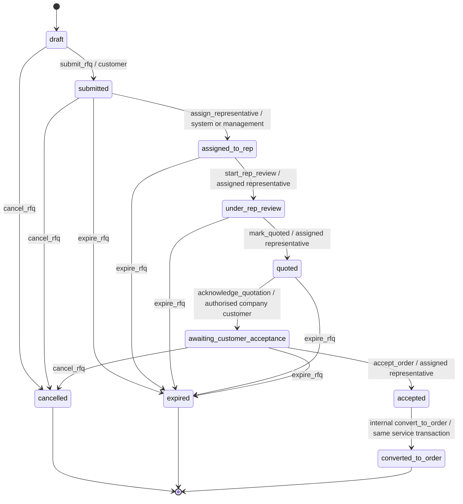
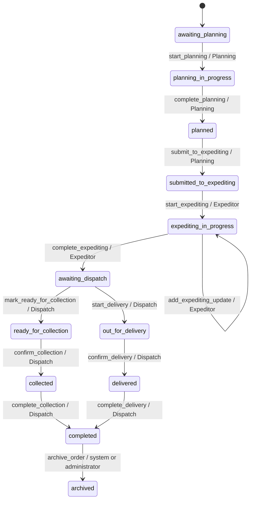

# RFQ and order workflow state machine

Status: implemented in mock-preview and API adapter layers; the private-cloud backend remains proposed.

## Source of truth

`src/domain/workflow.js` is the only module that decides whether an RFQ or order may change status. It defines:

- all RFQ and order status IDs;
- human-readable labels plus customer and internal descriptions;
- customer visibility and progress metadata;
- actions available from each status;
- named permissions, roles, required fields, comments, notifications and timestamp fields for each action;
- representative-assignment, accepted-order, fulfilment and hold/resume guards;
- controlled management overrides;
- workflow-event and audit-event creation.

React never sends a target status. It renders the `allowedWorkflowActions` returned by the service and submits an action code. The mock service calls the domain validator locally; the future API must run the same rules authoritatively on the server.

```text
React screen
  -> workflow.performAction(recordId, action request)
      -> service authorises record scope
          -> workflow validator checks state + permission + role + assignment + fields + version
              -> atomic record update + workflow event + audit event + notification outbox item
```

## Permission enforcement

`src/services/contracts.js` maps every workflow action to one named permission. A transition is available only when the account has the action permission **and** its role is allowed at that exact stage. The stage-role list remains important for shared actions such as hold/resume, while the permission catalogue provides one reusable source for navigation, service checks, tests and the future API.

| Workflow area | Actions | Named permission |
|---|---|---|
| Customer submission | `submit_rfq` | `create_rfq` |
| RFQ assignment | `assign_representative` | `assign_rfq` |
| Representative review | `start_rep_review` | `mark_rfq_under_review` |
| Quotation confirmation | `mark_quoted` | `mark_rfq_quoted` |
| Quotation receipt | `acknowledge_quotation` | `acknowledge_quotation` |
| Acceptance/conversion | user-facing `accept_order`; internal `convert_to_order` | `accept_customer_order`, `convert_rfq_to_order` |
| Planning | `start_planning`, `complete_planning`, `submit_to_expediting` | `add_planning_information`, `submit_to_expediting` |
| Expediting | `start_expediting`, `add_expediting_update`, `complete_expediting` | `update_order_progress`, `move_to_dispatch` |
| Dispatch | collection and delivery actions | `confirm_collection` or `confirm_delivery` |
| Exceptional controls | hold/resume, cancel, archive, override | `manage_order_hold`, `cancel_order`, `archive_orders`, `override_workflow` |

The trusted backend `system` actor may run only transitions that explicitly include `system`; it is never a browser-selectable role.

## RFQ flow



### RFQ transition contract

| Action | From -> to | Permitted roles | Required data | Comment | Notify | Timestamp |
|---|---|---|---|---:|---:|---|
| `submit_rfq` | `draft` -> `submitted` | Customer | company, application, configured units | No | No; direct success confirmation | `submittedAt` |
| `assign_representative` | `submitted` -> `assigned_to_rep` | System, manager, administrator | selected representative | No | Yes | `assignedAt` |
| `start_rep_review` | `assigned_to_rep` -> `under_rep_review` | Assigned sales representative, manager, administrator | assignment match for representative | No | No | `reviewStartedAt` |
| `mark_quoted` | `under_rep_review` -> `quoted` | Assigned sales representative, manager, administrator | quotation number, quotation date and expiry rule; assignment match for representative | Separate optional internal/customer notes | Customer and assigned representative | `quotedAt` |
| `acknowledge_quotation` | `quoted` -> `awaiting_customer_acceptance` | Authorised company customer | company ownership and exact prior status | No | Assigned representative | `quotationAcknowledgedAt` |
| `accept_order` | `awaiting_customer_acceptance` -> `accepted` and immediately `converted_to_order` | Assigned sales representative, manager, administrator | acceptance type/date/internal note/verification; PO number or payment reference when applicable | Internal note | Customer, assigned representative and Planning after conversion | `acceptedAt`, then `convertedToOrderAt` |
| `convert_to_order` | transient `accepted` -> `converted_to_order` | Internal conversion service only | service-generated `orderId` and permanent `orderReference` | No | Customer, assigned representative and Planning | `convertedToOrderAt` |
| `cancel_rfq` | eligible non-terminal RFQ -> `cancelled` | Customer only at approved external stages; otherwise manager or administrator | none | Yes | Yes | `cancelledAt` |
| `expire_rfq` | active submitted RFQ -> `expired` | System, manager, administrator | none | Yes | Yes | `expiredAt` |

`Accept Order` is the only action exposed to the representative. The service first validates the acceptance evidence, then performs the transient `accepted` step and the internal `convert_to_order` step as one compound operation. The UI cannot invoke `convert_to_order` or supply an order identifier/reference.

The mock service generates the order identifier and permanent reference, creates immutable order-item/configuration snapshots and updates the RFQ/order arrays through one versioned aggregate write. A repeated `accept_order` request returns the already linked order instead of creating a duplicate. This provides deterministic preview behaviour; the future backend must reproduce the RFQ lock, acceptance insert, order/items insert, RFQ link, events, audits and notification-outbox writes in one PostgreSQL transaction, with a unique source-RFQ constraint as the final duplicate guard.

### RFQ submission and representative inbox

The mock submission service validates the signed-in customer/company, reloads the selected representative from the approved area directory, allocates a permanent reference and records the submission before performing the immediate system assignment. Submission is the first workflow and audit entry. Assignment creates exactly one in-app notification for the assigned representative and makes the RFQ visible through `enquiries.listRepresentativeInbox()`.

The customer receives a direct success confirmation and a customer-visible `submitted` projection. The assigned representative sees the internal `assigned_to_rep` status and receives `Start Review`; that action is available only to the matching representative (or authorised management role) and moves the RFQ to `under_rep_review`.

### Quotation confirmation and receipt acknowledgement

The actual quotation remains an Outlook document prepared and emailed outside the application. `Mark as Quoted` records only the confirmation metadata needed to follow the RFQ: quotation number, quotation date, optional expiry, optional Outlook-email confirmation, separate internal and customer-facing notes, and optional document evidence. The workflow rejects pricing fields.

An uploaded file in mock mode is reduced to safe metadata and its bytes are not persisted. A document reference or metadata is exposed to the customer only when the representative explicitly authorises customer visibility. The preview never creates a false download link; a production download must be an authorised API response backed by protected object storage.

The customer sees that the quotation was emailed separately and may select `I received the quotation`. This acknowledgement changes the RFQ to `awaiting_customer_acceptance`, records its actor and timestamp, audits the action and notifies the assigned representative. It confirms receipt only. It does not accept pricing, confirm payment or a Purchase Order, create an order, or replace the representative's later `accept_order` action based on externally received evidence.

### Order acceptance and atomic conversion

The assigned representative records one of `purchase_order_received`, `payment_confirmed`, `written_acceptance_received`, `account_customer_authorisation` or `other`, plus the acceptance date, a required internal verification note and the verification checkbox. A Purchase Order number is mandatory for Purchase Order acceptance; a transaction reference is mandatory for externally confirmed payment. Optional supporting evidence is retained as private metadata in mock mode.

The workflow contains no price fields and does not process payment. Both shared form validation and the domain guard reject price payloads, card numbers, banking credentials, PINs and passwords. Customer projections omit the acceptance record and accepting-user identity.

On success, the response contains the historical RFQ in `converted_to_order` and its newly linked order in `awaiting_planning`. The accepted and converted workflow events are linked through the same request, the new order has its own creation event, and the customer, assigned representative and Planning receive role-appropriate notifications.

## Order flow



### Order transition contract

| Action | From -> to | Permitted roles | Required data/guard | Comment | Notify | Timestamp |
|---|---|---|---|---:|---:|---|
| `start_planning` | `awaiting_planning` -> `planning_in_progress` | Planning, manager, administrator | source RFQ converted and `acceptedAt` present | No | No | `planningStartedAt`, `planningStartedBy` |
| `complete_planning` | `planning_in_progress` -> `planned` | Planning, manager, administrator | job number, Planning owner, submission date, assigned rep and customer PO or authorised exception; dates/priority/references valid | No | No | `plannedAt`, `plannedBy` |
| `submit_to_expediting` | `planned` -> `submitted_to_expediting` | Planning, manager, administrator | persisted Planning record passes the same hand-off validation | No | Yes: customer, assigned rep, Expeditor | `submittedToExpeditingAt`, `submittedToExpeditingBy` |
| `start_expediting` | `submitted_to_expediting` -> `expediting_in_progress` | Expeditor, manager, administrator | `planning_received` plus customer-facing message | Separate optional internal note | Customer and assigned rep | `expeditingStartedAt`, `expeditingStartedBy` |
| `add_expediting_update` | `expediting_in_progress` -> same status | Expeditor, manager, administrator | recognised selectable progress step plus customer-facing message | Separate optional internal note | Customer and assigned rep | `expeditingUpdatedAt`, `lastExpeditingUpdatedBy` |
| `complete_expediting` | `expediting_in_progress` -> `awaiting_dispatch` | Expeditor, manager, administrator | `ready_for_dispatch`, completion check, and all required steps or authorised exception evidence | Separate optional internal note | Customer, assigned rep and Dispatch | `submittedToDispatchAt`, `submittedToDispatchBy` |
| `mark_ready_for_collection` | `awaiting_dispatch` -> `ready_for_collection` | Dispatch, manager, administrator | fulfilment is collection | No | Yes | `readyForCollectionAt` |
| `start_delivery` | `awaiting_dispatch` -> `out_for_delivery` | Dispatch, manager, administrator | fulfilment is delivery | Yes | Yes | `outForDeliveryAt` |
| `confirm_collection` | `ready_for_collection` -> `collected` | Dispatch, manager, administrator | exact prior status | Yes | Yes | `collectedAt` |
| `confirm_delivery` | `out_for_delivery` -> `delivered` | Dispatch, manager, administrator | exact prior status | Yes | Yes | `deliveredAt` |
| `complete_collection` | `collected` -> `completed` | Dispatch, manager, administrator | exact prior status | No | Yes | `completedAt` |
| `complete_delivery` | `delivered` -> `completed` | Dispatch, manager, administrator | exact prior status | No | Yes | `completedAt` |
| `place_on_hold` | active operational stage -> `on_hold` | Role owning the stage, manager, administrator | current stage stored as resume target | Yes | Yes | `heldAt` |
| `resume_order` | `on_hold` -> stored prior stage | Role owning the stored stage, manager, administrator | valid stored resume status | Yes | Yes | `resumedAt` |
| `cancel_order` | active order -> `cancelled` | Manager, administrator | none | Yes | Yes | `cancelledAt` |
| `archive_order` | `completed` or `cancelled` -> `archived` | System, administrator | `retentionPolicyId` | No | No | `archivedAt` |

### Planning record and hand-off

`complete_planning` persists one structured internal Planning record:

- internal job number;
- customer Purchase Order number, or an authorised exception flag and reason;
- internal Planning notes;
- optional planned start and estimated completion dates;
- assigned Planning user;
- optional production location/branch;
- `standard`, `high` or `urgent` priority;
- up to ten optional document-control references;
- required Planning submission date.

The service resolves the selected Planning user and location from authorised reference data before calling the state machine. The state machine validates the nested record again, so direct callers cannot bypass the form rules.

`submit_to_expediting` revalidates the persisted record and assigned representative. On success it writes the Planning actor and timestamp, workflow and audit history, and recipient-specific notifications. The customer message states only that Planning processed the order and it entered the fulfilment queue; internal Planning fields are excluded from the customer projection.

### Expediting progress and Dispatch hand-off

`src/domain/expediting.js` defines the mock progress catalogue as data rather than JSX branches. The production API exposes the reviewed equivalent through `expediting.getWorkspaceOptions()`. The starting catalogue is:

1. `planning_received`
2. `materials_checked`
3. `materials_ordered`
4. `awaiting_materials`
5. `materials_received`
6. `production_started`
7. `assembly_in_progress`
8. `calibration_or_testing`
9. `quality_check`
10. `paperwork_preparation`
11. `ready_for_dispatch`
12. operational `on_hold`
13. terminal `cancelled`

The default required-for-Dispatch subset is `planning_received`, `materials_checked`, `production_started`, `calibration_or_testing`, `quality_check`, `paperwork_preparation` and `ready_for_dispatch`. Optional material/assembly steps may be used when relevant without forcing an inappropriate step onto every order.

Every Expediting update contains the configured step, customer-facing message, optional internal note, optional estimated completion date, optional delay reason, optional controlled document/image metadata, session-derived updater and timestamp. `add_expediting_update` is an explicitly allowed same-status transition: it creates a new immutable progress/timeline/audit record without pretending that the top-level order moved out of `expediting_in_progress`.

An Expediting hold records the `on_hold` step, customer message and required delay reason while preserving both the prior top-level status and prior normal Expediting step. Resume requires a normal step and clears the current delay. The role owning the stored stage, or authorised management, is the only actor permitted to resume.

`complete_expediting` appends `ready_for_dispatch` and checks the completed-step set. If a required step is absent, hand-off is denied unless a controlled exception has an adequate reason and authorisation reference. A valid hand-off changes the top-level order to `awaiting_dispatch`, adds workflow/audit history and creates independent customer, assigned-representative and Dispatch notifications. It remains read-only in the Expeditor queue for hand-off awareness.

## Controlled override

Only `manager` and `administrator` may invoke `override_workflow`. The request must include:

- a valid target status belonging to the same RFQ/order workflow;
- `overrideReason` distinct from the ordinary comment;
- a comment for the audit history;
- the current record version.

The event and audit entry are marked `isOverride: true`. Archived records cannot be reopened in the preview. The UI intentionally does not expose the override action yet; the service contract exists for a later protected management screen.

## Customer visibility

Internal status remains authoritative. Customer responses expose only workflow events marked customer-visible. For example, automatic representative assignment and the internal `planned` stage are recorded and audited but omitted from the customer timeline. The customer projection displays the latest customer-visible status, exposes only customer-owned allowed actions and never exposes internal workflow actions, quotation internal notes, unauthorised quotation evidence, or representative-only acceptance evidence.

Planning projections follow the same rule: customers never receive the structured Planning record, internal/compatibility job and PO fields, Planning notes or schedule, production location, document references, or internal Planning actor metadata.

Expediting projections expose only the current public progress step, current estimated completion date and customer-visible updates. They omit internal notes, delay/supplier context, controlled document/image references, internal actor IDs and hand-off exception evidence. Customer-visible updates still appear in both the customer and assigned representative timelines.

This display filtering is not the security boundary. In production, the API must enforce company scope and event visibility before serialisation.

## Action request and result

Service request:

```json
{
  "entityType": "order",
  "action": "complete_expediting",
  "comment": "",
  "data": {
    "expeditingUpdate": {
      "progressStep": "ready_for_dispatch",
      "customerMessage": "Your order has completed Expediting and is moving to Dispatch.",
      "internalNote": "Fabricated internal test hand-off note.",
      "estimatedCompletionDate": "2026-08-05",
      "delayReason": "",
      "document": null,
      "customerVisible": true
    },
    "completionCheckConfirmed": true,
    "expeditingHandoff": {
      "authorisedException": false,
      "exceptionReason": "",
      "exceptionAuthorisationReference": ""
    }
  },
  "expectedVersion": 5
}
```

The API adapter sends the validated body without trusting a browser-supplied actor or company. A successful result returns the updated authorised record, its new version and refreshed `allowedWorkflowActions`. A stale version returns `409 WORKFLOW_VERSION_CONFLICT`.

Every successful action creates:

1. an immutable workflow event containing action, from/to status, actor role, descriptions, visibility and time;
2. an append-only audit event with outcome `success`;
3. a notification/outbox record when `generatesNotification` is true.

Denied actions create an audit event with outcome `denied` in mock mode. The backend must do the same without leaking an inaccessible record to the caller.

## Legacy mock migration

The GitHub Pages mock converts the previous demo status IDs during service initialisation. Examples:

| Previous preview status | Controlled status |
|---|---|
| `rfq-submitted` | `submitted` |
| `under-review` | `under_rep_review` |
| `quotation-sent` | `awaiting_customer_acceptance` |
| `po-received` | `awaiting_planning` |
| `scheduled` | `submitted_to_expediting` |
| `in-production`, `quality-check` | `expediting_in_progress` |
| `ready` | `awaiting_dispatch` |
| `dispatched` | `out_for_delivery` |

This is a preview compatibility migration, not a production data-migration specification.

## Verification

`tests/permissions.test.mjs` verifies the permission catalogue, role grants, centralized navigation, assigned/company scope and exact Planning/Expediting/Dispatch queues. `tests/workflow.test.mjs` covers valid paths and rejects:

- customers changing internal statuses;
- representatives acting on RFQs not assigned to them;
- Planning starting an unaccepted order;
- Planning completing an order without an assigned representative, valid owner/submission date, or customer PO/authorised exception;
- Planning hand-off with missing or tampered persisted Planning data;
- Expediting acting before Planning handoff;
- invalid or operational progress steps submitted through the ordinary Expediting update action;
- Expediting hand-off before required steps are complete and incomplete authorised-exception evidence;
- customer access to Expediting internal notes or exception metadata;
- Dispatch skipping the ready/out-for-delivery step;
- missing mandatory fields and comments;
- the wrong role resuming a held order;
- unauthorised step skipping and incomplete override evidence.

`tests/mock-services.test.mjs` verifies validated RFQ submission snapshots, permanent references, document metadata, first audit entry, single representative assignment notification, representative inbox isolation, Start Review, separate RFQ/order services, atomic `accept_order` conversion, immutable item snapshots, idempotent duplicate protection, exact role queues through Sales/Planning/Expediting/Dispatch, inactive Buyer scope, wider Manager/Administrator oversight, company isolation, recipient-scoped notifications and per-user read state, customer-visible history filtering, successful and denied audit entries, legacy combined-record migration, CSRF/idempotency headers and API inbox/workflow routes. It also verifies the Expediting service configuration, start/update/hold/resume/handoff path, customer/representative timelines, internal-note projection and structured API payload. `tests/expediting.test.mjs` covers configured steps, required-step completion, queue counts, oldest-update sorting, every requested search key and due/hold/priority filters. `tests/rfq-inbox.test.mjs` covers stage groups, search, priority, RFQ age and sort order.

Quotation coverage additionally verifies required metadata, date/expiry validation, assignment and company isolation, internal/customer note separation, raw-file exclusion from mock storage, explicit document visibility, recipient-specific notifications, receipt acknowledgement, and confirmation that acknowledgement creates no order. API-adapter tests verify multipart boundaries only when quotation or acceptance files are supplied.
